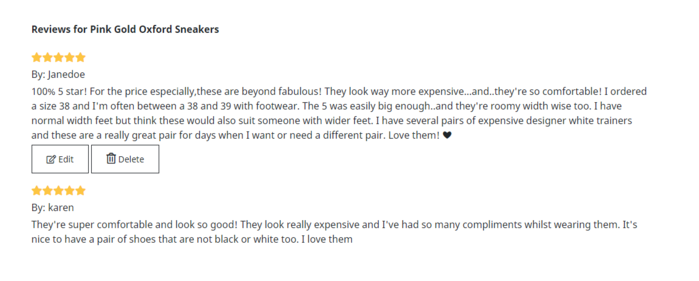

# **Shoes And More**
  

[View the live website here](https://shoes-and-more.herokuapp.com/)

</br>  

Welcome to Shoes and More website!
Shoes and More is an e-commerce website that sells shoes and accessories (bags, wallets, etc). It's completed with authentication mechanism and stripe payments to allow users to safely purchased products from the site.  

Please note that this website was created for the Code Institute’s Milestone Project 4 as part of their Diploma in Full Stack Software Development. The requirements are to make a full-stack website, using HTML, CSS, JavaScript, Django+Python, relational database, stripe payments, and other additional libraries as needed. 

<br/>  

## **Table of Contents**   
1. [UX Development Planes](https://github.com/dissyulina/shoesandmore#ux-development-plane)   
   A. [Strategy Plane](https://github.com/dissyulina/shoesandmore#a-strategy-plane) 
      - [Project Goals, User Goals, and Site Owner Goals](https://github.com/dissyulina/shoesandmore#project-goals)   
      - [User Stories](https://github.com/dissyulina/shoesandmore#user-goals)   

   B. [Scope Plane](https://github.com/dissyulina/shoesandmore#b-scope-plane)  
   C. [Structure Plane](https://github.com/dissyulina/shoesandmore#c-structure-plane)  
   D. [Skeleton Plane (Wireframes)](https://github.com/dissyulina/shoesandmore#d-skeleton-plane)  
   E. [Surface Plane (High Fidelity Mock-ups)](https://github.com/dissyulina/shoesandmore#e-surface-plane)  
      - [Color Scheme](https://github.com/dissyulina/shoesandmore#color-scheme)  
      - [Typography](https://github.com/dissyulina/shoesandmore#typography)  
2. [Database Design](https://github.com/dissyulina/shoesandmore#database-design)  
3. [Features](https://github.com/dissyulina/shoesandmore#features)   
   A. [General Design Features](https://github.com/dissyulina/shoesandmore#a-general-design-features)   
   B. [Page Features](https://github.com/dissyulina/shoesandmore#b-page-features)  
   C. [Features to be Implemented in The Future](https://github.com/dissyulina/shoesandmore#c-features-to-be-implemented-in-the-future)
4. [Testing](https://github.com/dissyulina/shoesandmore#testing)    
   [Go to TESTING.md](https://github.com/dissyulina/shoesandmore/blob/main/TESTING.md#shoes-and-more---testing)
5. [Issues and Bugs](https://github.com/dissyulina/shoesandmore#issues-and-bugs)  
6. [Technology Used](https://github.com/dissyulina/shoesandmore#technology-used)  
   A. [Main Languanges](https://github.com/dissyulina/shoesandmore#a-main-language)  
   B. [Libraries and Frameworks](https://github.com/dissyulina/shoesandmore#b-libraries-and-frameworks)  
   C. [Packages / Dependencies](https://github.com/dissyulina/shoesandmore#c-packages--dependecies-installed)  
   D. [Database, Payment Service, and Cloud Storage](https://github.com/dissyulina/shoesandmore#d-database-management)  
   E [Tools and Programs](https://github.com/dissyulina/shoesandmore#e-tools-and-programs)  
7. [Deployment](https://github.com/dissyulina/shoesandmore#deployment)  
   A. [How To Use This Project](https://github.com/dissyulina/shoesandmore#a-how-to-use-this-project)  
   B. [Deployment to Heroku](https://github.com/dissyulina/shoesandmore#b-deployment-to-heroku)   
   C. [AWS Bucket Creation](https://github.com/dissyulina/shoesandmore#c-aws-bucket-creation)  
   D. [Connect Django to AWS Bucket](https://github.com/dissyulina/shoesandmore#d-connect-django-to-aws-bucket)   
8. [Credits](https://github.com/dissyulina/shoesandmore#credits)  
   A. [Code](https://github.com/dissyulina/shoesandmore#a-code)  
   B. [Images](https://github.com/dissyulina/shoesandmore#b-images)  
   C. [Contents](https://github.com/dissyulina/shoesandmore#c-content)  
9. [Acknowledgements](https://github.com/dissyulina/shoesandmore#acknowledgements)   

------

 
<br/>  

## **UX DEVELOPMENT PLANE**   
### **A. Strategy Plane**  
#### **Project Goals**   
The primary goal of this project is to create an e-commerce website that works perfectly, is visually appealing in design, and intuitive for a first time user. It allows user to perform not only the basic functionalities in an e-commerce website (such as sign up/ log in, ability to purchase items and perform payments), but also to ensure that users have a great experience and more interactivity within the site through additional functionalities such as put items into their wishlist, and write reviews, and reading articles.  

#### **User Goals**  
The user is looking for:
- An online store / website that is straightforward and intuitive to use, easy to navigate and to make a purchase on the site. 
- An online store/ website where the user can have other additional activities and engage more store.  

The target user for this site is:
- Young adult, between 18 - 40
- Fun, fashionable people
- People who enjoy the convenience of using technology and social media


#### **Site Owner Goals**  
The site owner is looking to:
- Be able to make money by providing products (and services) to the users. 
- Manage products in the website.

#### **User Stories** 
As a shopper I want to be able to:
   1. Quickly identify what products/services the site sells.  
   2. Quickly identify deals and special offers.   
   3. Search for a product.   
   4. Identify a glimpse of most populars products.   
   5. View all products, and easily navigate between categories.  
   6. Sort by price, by rating, and by popularity.  
   7. View individual product's page and read the relevant information.  
   8. Read a product's review.  
   9. Easily select size and quantity of the product, and add it to shopping bag.  
   10. View the shopping bag with products added in it.  
   11. Update the shopping bag by adjusting the quantity of the products, or removing them from the shopping bag.  
   12. Checkout and easily enter my payment information.  
   13. Feel my personal and payment information is safe and secure.  
   14. View an order confirmation after purchasing.  
   15. Receive an email confirmation after purchasing.  
   16. Read relevant articles/ blogs about shoes or accessories.  
   17. Easily navigate within the site, through Navigation Bar and Footer.  
   18. Easily register for an account.  
   19. Find FAQ section for my questions.  
   20. Contact the shop via a contact form.    

As a registered user/ shopper, I want to be able to:
   1. Access all functionalities that an unregistered shopper can do.  
   2. Easily login or logout.  
   3. Easily recover my password in case I forget it.  
   4. Receive an email confirmation after registering.  
   5. Have a personalized user profile where I can see my order history and change my information.  
   6. Review products that I have purchased before.  
   7. Edit and delete my reviews.  
   8. Add products to the wishlist, so I can quickly find products I'd like to purchase. 
   9. Remove products from the wishlist, so I can remove products I don't wish to purchase.
   10. Easily put the wishlist products into the shopping bag.   

As an admin and store management, I want to be able to:
   1. Add a product.  
   2. Edit or update a product.  
   3. Delete a product.  

<br/>  

### **B. Scope Plane**  
Based on all goals and user stories, a scope was defined for the site with room for future improvements.  

#### **Functional Requirements**  
The unregistered users will be able to:
- Sign up to the site by providing username, email, and password.  
- View all products and sort them by price, rating, and color.
- Search for products
- View product's detail.
- Add products to the shopping bag.
- Update and remove items in the shopping bag.
- Checkout and make a payment.
- Receive email confirmation of the transaction.  

The registered users will be able to:
- Do all things that unregistered users able to do. 
- Log in to the site by providing username and password.
- View profile page.
- Update delivery / contact information on their profile page.
- View order history on their profile page.
- Write reviews for products that they have purchased.
- Edit those reviews.
- Delete those reviews.
- Add products to their wishlist.
- Remove products from wishlist.  

The admin/ site owners will be able to:
- Have all functionalities as a registered user.  
- Add a product to the site.  
- Edit or update a product.  
- Delete a product.  

#### **Non-functional Requirements**  
Users will be able to:
- View articles/ blogs about shoes, accessories, and fashion in general.
- View FAQ page to find answers for their questions.
- Send message to the store via contact form.
- Navigate easily and intuitively throughout the site.  

<br/>  

### **C. Structure Plane**  
The website was organized in a Hierarchical Tree Structure that ensures the user can navigate easily and intuitively. Below is the website workflow (was designed using [Creately](https://creately.com/)).  

   
There's a clear page access separation between unregistered users and registered user. While unregistered users can still purchase products and receive the confirmation via email, they are not able to:
- View their order history
- Give reviews (and edit or delete their reviews accordingly)  
- Make a favorite list of products.  

Those features mentioned are available for registered users.

<br/>  

### **D. Skeleton Plane**  
Wireframes were created using Figma to design the navigation and interface of the website. The wireframes were created only for desktop, which then will be transformed to high fidelity mock-ups in various device sizes (see Surface Plane). 

- [Wireframe for Home page](readme-testing-files/readme/wireframes/wireframe-home.png) 
- [Wireframe for Products page](readme-testing-files/readme/wireframes/wireframe-products.png)  
- [Wireframe for Individual Product page](readme-testing-files/readme/wireframes/wireframe-individual-product.png)  
- [Wireframe for Favorites page](readme-testing-files/readme/wireframes/wireframe-favorites.png)  
- [Wireframe for Shopping Bag page](readme-testing-files/readme/wireframes/wireframe-shoppingbag.png)  
- [Wireframe for Checkout page](readme-testing-files/readme/wireframes/wireframe-checkout.png)  
- [Wireframe for Profile page (Update user's information)](readme-testing-files/readme/wireframes/wireframe-profile-updateinfo.png)  
- [Wireframe for Profile page (View order history)](readme-testing-files/readme/wireframes/wireframe-profile-orderhistory.png)  
- [Wireframe for Profile page (Reviews)](readme-testing-files/readme/wireframes/wireframe-profile-reviews.png)  
- [Wireframe for Articles page](readme-testing-files/readme/wireframes/wireframe-articles.png)  
- [Wireframe for Individual Article page](readme-testing-files/readme/wireframes/wireframe-individual-article.png)  
- [Wireframe for Contact page](readme-testing-files/readme/wireframes/wireframe-contact.png)  
- [Wireframe for Add / Edit Review page](readme-testing-files/readme/wireframes/wireframe-add-edit-review.png)  
- [Wireframe for Sign Up page](readme-testing-files/readme/wireframes/wireframe-signup.png)  
- [Wireframe for Log In page](readme-testing-files/readme/wireframes/wireframe-login.png)  

<br/>  

### **E. Surface Plane**  
High fidelity mock-ups were created using Figma as well for a better and clearer visualization before coding, and also to check if the color scheme and images match and work great together. This has allowed the developer to concentrate solely on the development part (front end and back end), as the design has already made with such details. The high fidelity mock-ups were created in three different device sizes - desktop, tablet, and mobile.  

- [High Fidelity Mock-up for Home page](readme-testing-files/readme/high-fidelity-mockups/mockup-home.png)  
- [High Fidelity Mock-up for Products page](readme-testing-files/readme/high-fidelity-mockups/mockup-products.png)  
- [High Fidelity Mock-up for Individual Product page](readme-testing-files/readme/high-fidelity-mockups/mockup-individual-product.png)  
- [High Fidelity Mock-up for Favorites page](readme-testing-files/readme/high-fidelity-mockups/mockup-favorites.png)  
- [High Fidelity Mock-up for Shopping Bag page](readme-testing-files/readme/high-fidelity-mockups/mockup-shoppingbag.png)  
- [High Fidelity Mock-up for Checkout page](readme-testing-files/readme/high-fidelity-mockups/mockup-checkout.png)  
- [High Fidelity Mock-up for Profile page (Update user's information)](readme-testing-files/readme/high-fidelity-mockups/mockup-profile-updateinfo.png)  
- [High Fidelity Mock-up for Profile page (Order History)](readme-testing-files/readme/high-fidelity-mockups/mockup-profile-orderhistory.png)  
- [High Fidelity Mock-up for Profile page (Reviews)](readme-testing-files/readme/high-fidelity-mockups/mockup-profile-reviews.png)  
- [High Fidelity Mock-up for Articles page](readme-testing-files/readme/high-fidelity-mockups/mockup-articles.png)  
- [High Fidelity Mock-up for Individual Article page](readme-testing-files/readme/high-fidelity-mockups/mockup-individual-article.png)  
- [High Fidelity Mock-up for Contact page](readme-testing-files/readme/high-fidelity-mockups/mockup-contact.png)  
- [High Fidelity Mock-up for Add / Edit Review page](readme-testing-files/readme/high-fidelity-mockups/mockup-add-edit-review.png)  
- [High Fidelity Mock-up for Sign Up page](readme-testing-files/readme/high-fidelity-mockups/mockup-signup.png)  
- [High Fidelity Mock-up for Log In page](readme-testing-files/readme/high-fidelity-mockups/mockup-login.png)  

#### **Color Scheme**  
The overall color-theme of the website was natural earthy colors, which have relaxing and comforting influences, and encourages feelings of warmth and calmness. Using [Coolors](https://coolors.co), I started with beige (#E8DCD5) and brown (#644536), and generated one more color that compliments them both - the result was a salmon color (#B2675E). I also found a hero image that fits the overal theme and colors accordingly.   
  

#### **Typography**  
All of the fonts were sourced from [Google Fonts](https://fonts.google.com).   
- Main font: Noto Sans   
   Noto Sans is a sans-serif font, used as the main font, for all paragraphs and buttons. Open Sans was chosen because it has a modern and clean style. 
- Secondary font: DM Serif Display    
   DM Serif Display is a serif font, used as the headers font on the Home page, in order to contrast them with serif font.  


#### **Design Changes on The Final Product**  
While I relied heavily on these Wireframes in order to maintain the desired design, there are several differences between the Mockups and the final product:
- I changed the logo to a new one that's thicker and easier to spot, as the previous logo in the mockups was too thin and didn't look good on small devices.
- In the wireframes and mockups, there was a subscription to the newsletter box. I decided not to include this subscription to the newsletter functionality on the final product due to time constraint. 
- The color #B2675E was changed to a slightly dark color #A5554C, because it didn't have enough contrast when paired with white text.
- Minor things like buttons colors and image difference were purely design choices that was taken during with the website development. 


<br/>  

## **DATABASE DESIGN**    

Database schema was designed using [drawsql](https://drawsql.app/). The database was first managed using SQLite during the development process, then Postgres in production with Heroku. 
  

- **Category model**   
   - Stores category name for a product. The categories in this case are Women, Men, and Kids.
   - Name field: the name used for database purpose.
   - Friendly_name field: the name used for display.

- **Subcategory model**
   - Stores subcategory name for a product. The subcategories in the database are Sandals, Sneakers, Oxfords, Heels, Boots, Mules, Flats, Outdoors, Loafers, Slippers, Sale, Accessories, and New Arrivals.  
   - The Category model and Subcategory model have no relationship. I decided not to define a relationship/ pairing between them to make it more flexible. Both are fully independent of each other.  
   - Name field: the name used for database purpose.
   - Friendly_name field: the name used for display.  
   
- **Product model**  
   - Stores detailed information about a product.
   - Category field: the category of the product, a foreign key from Category model.
   - Subcategory field: the subcategory of the product, a foreign key from Subcategory model. 
   - Sku field: alpha numeric code assigned for a product.
   - Name field: the name of the product, a required field.
   - Has_sizes: has a boolean value - Yes for shoes, No for accessories.
   - Price: the price of the product, a required field.
   - Rating: the rating of the product. Each product has an initial rating value given by retailer based on its quality from manufacturer. The default value is 3. Each time a user gives a rating to the product, it calculates the average and update this field (read more about this on Feature section - Add Review)  
   - Image: the image of the product.
   - Total_purchased: the quantity of purchased for this product. The initial (default) value is 0. Each time a user purchases the product, the value also adds up.  

- **User model**  
   - Stores registration information of a user, the model was created as one of the components of Django's authentication system (more information on this, see [django.contrib.auth](https://docs.djangoproject.com/en/4.0/ref/contrib/auth/)). The fields include (but not limited to) username, email, and password.  

- **Order model**
   - Stores all information related to a successfully placed order.
   - Order_number field: a unique order number generated automatically using UUID.
   - User_profile field: the user that ordered, a foreign key from UserProfile model (if the user is registered).
   - Full_name field: the full name of the buyer.
   - Email field: the email address of the buyer.
   - Phone_number: the phone number of the buyer.
   - Street_address1: the first line of street address of the buyer.
   - Street_address2: the second line of street address of the buyer.
   - Town_or_city: the town or city name of the buyer.
   - Postcode: the postcode of the buyer.
   - Country: the country of the buyer.
   - Date: the date of purchase.
   - Delivery_cost: the delivery cost of the transaction.
   - Order_total: the total price of order (the total of quantity times individual product price).
   - Grand_total: the order_total + delivery_cost.
   - Original_bag: a json object of the products and sizes that were in the bag.
   - Stripe_pid: a payment intent id from stripe for successfull order.

- **OrderLineItem model**
   - Stores order details of a product that have been purchased.
   - Product field: the product ordered, a foreign key from Product model.
   - Order field: the order number for this product ordered, a foreign key from Order model.
   - Product_size field: the size of the product ordered.
   - Quantity field: the quantity of the product ordered.
   - Lineitem_total field: the quantity times the individual product price.  

- **UserProfile model**
   - Stores user's address information for registered user.
   - User field: the user itself, a foreign key from User model.
   - Default_phone_number field: the phone numbe of the user.
   - Default_street_address1 field: the first line of street address of the user.
   - Default_street_address2 field: the second line of street address of the user.
   - Default_town_or_city field: the town or city name of the user.
   - Default_postcode field: the postcode of the user.
   - Default_country field: the country of the user.  

- **Review model**  
   - Stores user's review of products that the user had previously purchased.
   - Product field: the reviewed product, a foreign key from Product model.
   - User field: the user itself, a foreign key from UserProfile.
   - Rating: the rating that the user gave for the product.
   - Review_text: the review that the user gave for the product.
   - Date: the date it was created.

- **Blog model**  
   - Stores articles/ blogs for the website.
   - Image field: the image for the article.  
   - Author field: the author of the article, a foreign key from User model.
   - Title field: the title for the article.
   - Paragraph1: the first paragraph for the article.
   - Paragraph2: the second paragraph for the article.
   - Paragraph3: the third paragraph for the article.
   - Created_on: the data it was created.  

- **Favorites model**  
   - Stores list of favorites products of a registered user.
   - User: the user that created the favorites list, a foreign key from User model.
   - Products field: the list of products.  
   - Because there would be a many to many relationship between favorites and products, i.e. one product can be listed in multiple (users) favorites , and one favorites can have multiple of products, I decided to define a through/ intermediary model between the two models ([source from django documentation](https://docs.djangoproject.com/en/4.0/ref/models/fields/#django.db.models.ManyToManyField.through_fields)). The through model named  **FavoritesItem model**, which stores each product in one table with favorites as a foreign key.  

- **Topic model**
  - Stores the topics of contact form. 
  - Subject field: a one-word name for database purposes.
  - Text field: a longer name for display on the contact form.
  - I decided to make this into separate model instead of a choice field, because I wanted to define a separate naming fields for database and for display, and for future flexibility in adding/ editing/ removing a topic.  

- **ContactForm model**
  - Stores the contact form filled by the user.
  - Name field: the name of the user.
  - Email field: the email of the user.
  - Topic field: the topic of the message, a foreign key from Topic model.
  - Order_number: the order number if the user has it. Filled manually by the user.
  - Message: the message in the form.
  - Date: the date it was sent.  

<br/>  

## **FEATURES**  
### **A. General Design Features**  
- **Fully responsive** - Each page of the site is fully responsive on all device sizes (with minimum dimension 320px or an iPhone 4/5) and features intuitive navigational buttons.  

- **Navbar** (on all pages)   
      

   - The Navbar is responsive and turns to a hamburger menu on a smaller device. It is also sticky, thus it follows along when the user scrolls down, so the user can easily navigate the site without scrolling back to the top.
   - The logo is placed at the top center of the Navbar, creating a simmetry between left and right, and links back to Home page.
   - A search box is positioned on the left side of the Navbar, providing the ease of searching a keyword from the beginning. 
   - For unregistered users, the Sign In buttons are visible right away, conventionally placed at the top-right of the page. It's a dropdown link which will give options to Register or to Log In. After the user successfully logged in, the previously Sign In button turns to a My Account dropdown button, which provides the links to My Profile and to Log Out.
   - Favorites and Shopping Bag links are placed on the Navbar to give a quick access from any page the user is currently at.   
   - There are 6 nav-links to navigate between products categories and subcategories - All Products, Women, Men, Kids, Accessories, and Sale.
   - A sales banner about free delivery is placed right below the Navbar, and also displayed on all pages.  

- **Footer** (on all pages)  
    
   The Footer uses the same color as the Navbar and provides all navigation links, the social media links of the store as well (that opens in a new tab), and the logo that leads back to the Home page. Here we also have links to the Articles, the FAQ page, and the Contact page. Since the main business of Shoes And More is selling shoes and accessories, these three pages although still important, are not the main pages of the site. Therefore the links to these pages are only available on footer, which can be found on the bottom of every pages anyway.  

- **Toast message**   
Toast messages provide the user the necessary feedback of their activities whether it's successfully executed or not. The toast messages are color coded: red for error messages, blue for info/ alert messages, yellow for warning messages, and green for succcess messages. Users will get success toast the most, for example when users add a product to the shopping bag, they will get a success toast message with bag display. While when users for example add a product to their favorites list, they will get a success toast message without bag display. Below are the examples of success toast messages (without bag and with bag display).   

   


### **B. Page Features**  
#### **1. Home Page**  
[See the image of the Homepage here](readme-testing-files/readme/home-page.png)   
- On the Home page, I used multiple images as a marketing strategy to attract users attention to browse more into the website, and hopefully to make a purchase.  
- The hero-image covers 100% of the viewport height and width, with an impactful heading in a jumbotron to give the user a great first impression. It introduces the new arrivals, which are products for spring, with a CTA button to directly browse the new arrivals.  
- The sneakers collection section provides direct navigation to the sneakers.  
- The shoes for the whole family section provides direct navigation to the main categories based on gender/ age: Women, Men, and Kids.  
- The best sellers section gives information to users which products have been purchased the most, which indicates the most popular products. The products are displayed in a multi-items carousel of 8 products. If a product is purchased, the quantity of purchase will accumulate for each product. To get the 'best sellers' products, all products will be sorted according to their total purchased quantity from highest to lowest, and the 8 products with highest quantity are displayed in this section.   
- The final sale section provides direct navigation to the sale products.   
- The bags and accesssories section provides direct navigation to the accessories products.  
- The articles and blogs section displays the latest 3 articles written by store admin or other superusers. Users can also navigate to the articles page and view all articles by clicking the See More Articles button.  

#### **2. Products Page**  
[See the image of Products page here](readme-testing-files/readme/products.png)   
- The Products page starts with a breadcrumb navigation that indicates the current page’s location within a navigational hierarchy. For example, if the user chose the Women Sneakers, then the breadcrumb will show: Home > Women > Sneakers.
- Below the breadcrumb there's a 'Final Sale' banner, as normally users are interested in checking out the sale items first. If users click the shop now button, it will filter the products to display only the sale items. This Sale banner is not displayed on mobiles to save spaces. 
- Side Navigation feature (only on desktop) helps users to quickly navigate through the categories and subcategories, and will filter the products to display only the categories and subcategories of choice. On smaller devices, users can click the hamburger icon to navigate.  
- The Side Navigation can't be applied on mobiles and tablets due to the limitation of spaces. To replace it, a dropdown button is available on mobiles and tablets in order to provide the same functionality to navigate throughout subcategories.
- The result of products displayed can also be sorted by price (lowest to highest and highest to lowest), rating (highest to lowest), popularity/ best sellers (highest to lowest), and name (A to Z).  
- The products are displayed into 4 columns on large screen, 3 columns on medium screen, and 2 columns on small screen.  
- On the top right of each of the product's image, there's a heart icon that turns red when user hovers over it. By clicking this icon, a registered user can add the product to their favorites list. The heart icon will then turns red to indicate that the product has listed in user's favorites.
- A back to top button is in fixed positioned on the right side of the screen.  

#### **3. Individual Product Page**  
[See the image of Individual Product page here](readme-testing-files/readme/individual-product-page.png)  
- The Individual Product page starts with a breadcrumb navigation that indicates the current page’s location within a navigational hierarchy. 
- The page features the product's image, name, price, rating, category tag, and reviews on the bottom of the page. 
- On the top right of the product's image, there's a heart icon that turns red when user hovers over it. By clicking this icon, a registered user can add the product to their favorites list. The heart icon will then turns red to indicate that the product has listed in user's favorites.
- Users can add the product to their shopping bag by choosing the size, the quantity, and click Add to Bag button.  

**Review Section** 
- Under the product information, there's a review section which lists all the reviews for the product. If a user has written a review for the product before, the buttons to edit and to delete show up below it. A registered user is able to edit or delete their own review.  
Below are the example, if I logged in as user "Janedoe".  
   
If the user clicks the Edit button, they will be directed to Edit Review page [see Edit Review page](https://github.com/dissyulina/shoesandmore#11-add-edit-review-page).  
While if the user clicks the Delete button, a confirmation modal will pop out to confirm if the user really want to delete it.   
  


#### **4. Favorites Page**  
[See the image of Favorites page here](readme-testing-files/readme/favorites-page.png)  
- The Favorites page features all products that the user has been saved as their favorites. The products are displayed in resemblance with products page, using the product's image, name, price, and rating. They are displayed into 4 columns on large screen, 3 columns on medium screen, and 2 columns on small screen. 
- The heart icon on the top right of product's image is replaced by a trash icon, which indicates its function to remove the product from favorites.
- Since favorites are a list of products that the user is interested in and willing to buy, below each product, there are an option to choose the size and an Add to Bag button. This allows users to add the product to their shopping bag directly and easily, without going to the individual product page.  

#### **5. Bag Page**  
[See the image of Bag page here](readme-testing-files/readme/bag-page.png)  
- The Bag page features all products that the user has been added to the shopping bag, and the total price that the user has to pay (if the user decides to continue). On this page, users can adjust the quantity of products, or remove the products from the bag.  
- It displays the products information such as product's image, name, sku, price, size of choice, and the quantity of choice.
- A trash icon is placed on each product's row, which indicates that users can use this button to remove the specified product from their bag.
- The subtotal column informs users the product's price times the quantity. If the user changes the quantity, the subtotal changes accordingly.
- The total price, the delivery price, and the grand total are separated in a box, to gain user's attention on what the next action is. A CTA button to chekout, and a visual information of accepted method of payments are placed in the box as well.
- If the user decides to browse for more products, a Keep Shopping button is positioned below the grand total box as a secondary option.  

#### **6. Checkout Page**  
[See the image of Checkout page here](readme-testing-files/readme/checkout-page.png)  
- The Checkout page features the checkout form to process the transaction and the order information.
- The Chekout form is clearly divided into 3 sections: Details (user's full name and email), Delivery (user's delivery address), and Payment (user's card detail).  
- The order information is filled with summary of all products from the Bag page, along with the grand total. CTA buttons are present inside the box for the user to pay and therefore complete the order, or to go back to Adjust bag as secondary option. 

#### **7. Checkout Success Page**   
[See the image of Checkout Sucess page here](readme-testing-files/readme/checkout-success-page.png)  
- The Checkout Success page features the summary of order transaction that had just successfully processed, right after the user proceed to complete the order on Checkout page.
- Users can see the Order information, items list, delivery address, and billing information.
- Registered users can also find this summary of order on their Profile page.  

#### **8. Profile Page - My Information**  
[See the image of Profile page - My Information here](readme-testing-files/readme/profile-information-page.png)  
- The Profile page features three pill sections - My Information, My Purchases, and Ratings/ Reviews.
- On My Information section, users can update their delivery information. This information will pre-populate the Checkout form for future transactions, so that registered users don't have to fill it out all over again. They just have to fill the payment information.  
- By changing the input fields and clicking the Update Information button, the delivery information is updated in the database.  

#### **9. Profile Page - My Purchases**  
[See the image of Profile page - My Purchases here](readme-testing-files/readme/profile-orderhistory-page.png)  
- On My Purchases section, users can view all their order history, sorted by order date (from the earliest to the latest).
- Each order number can be clicked, and it will lead to the Checkout Success page of the order, so that user can see the detail information of that particular order.


#### **10. Profile Page - Ratings/Reviews**  
[See the image of Profile page - Ratings/Reviews here](readme-testing-files/readme/profile-reviews-page.png)  
- On Ratings/ Reviews section, user can view all products that they have purchased before and are waiting to be reviewed. Users can only review products that they have purchased before, so that they can give trustworthy reviews to the products. 
- Users can give rating and review by clicking the Give Review button on the right side of the product. They will then be directed to the Add Review page.   
- After the review for a product is added, the product will be removed from this section.  

#### **11. Add/ Edit Review Page**  
[See the image of Add/ Edit Review page here](readme-testing-files/readme/add-edit-review-page.png)  
- The Add Review page features a form to submit rating and review for the specified product. Users can give rating (range 1 to 5), and/or a review to the product. The rating is required (users can't submit the form if the rating is empty), while the review text input is not.
- To submit the rating and review, a Submit Review button is placed below the form. There's also a Cancel button which will bring users back to their profile (review section).
- After the review is submitted, users is directed back to their profile (review section) as well, to encourage user to review more products.
- Even though there are two separate templates each for Add Review page and Edit Review page, the display and layout are exactly the same between the two. The only difference is, on Edit Review page, the rating input and review text area are already prepopulated with the existing rating and review from the user. 
- As mentioned above on the Individual Product page, user can edit their review by accessing the Individual Product page first, find the review, and then click Edit button.  

#### **12. Articles Page**  
[See the image of Articles page here](readme-testing-files/readme/articles-page.png)  
- The Articles page features all relevant articles about shoes and accessories. This provides better customer experiences beside basic purchasing funtionality, and hopefully will increase users engagement with the store.  
- All articles are featured in a card-like display, with an image, a title, a small part of the article, and a Read the article link that will bring the user to the Individual Article page.  

#### **13. Individual Article Page**  
[See the image of Articles page here](readme-testing-files/readme/individual-article-page.png)  
- The Individual Article page feature the article itself, the image, the title, and date created. 
- Read more articles button is placed on the bottom-center of the page to bring users back to the Articles page.

#### **14. FAQ Page**  
[See the image of FAQ page here](readme-testing-files/readme/faq-page.png)  
- The FAQ page features the frequently asked questions about payment, order, return policy, etc. User can access this page by clicking the FAQ link on the footer.  
- If users can't find their answers in this page, they are invited to contact the store directly by clicking Go to Contact Page button placed on the bottom-center of the page.  

#### **15. Contact Page**  
[See the image of Contact page here](readme-testing-files/readme/contact-page.png)  
- The Contact Page features information on how to contact the store. It provides phone number, email address, and a contact form. 
- Users can fill out the contact form and submit it. The server side will store it in the database so the store admin can see and process all of the messages.

#### **16. Register and Log In Page**  
[See the image of Register page here](readme-testing-files/readme/register-page.png)  
[See the image of Login page here](readme-testing-files/readme/login-page.png)  
- The Register/ Sign Up page allows users to register to the website. To register, users have to provide email address, username, and password. After registration, users will get an email confirmation that requires users to activate their account by clicking a link. Only after the account is activated, users can access the website as registered users.  
- The Log In page allows registered users to log back in to the website. To login, users have to provide the email address or the username, and the password.  

#### **17. Product Management / Add Product page (Admin / Superuser only)**  
[See the image of Product Management page here](readme-testing-files/readme/add-product-page.png)  
- The Product Management page is only available for Admin or Superuser. This page can be accessed by clicking My Account on the Navbar after logging in as an admin.  
- The Product Management page features a form that functions to add a product to the store. On this form, admin can fill out the category, subcategory, sku, name, has sizes (true or false), price, rating, and image.  
- To submit the new product, an Add Product button is placed on the bottom-center of the page. A cancel button is available as well which will direct them to the products page. 

#### **18. Edit Product page (Admin / Superuser only)**  
[See the image of Edit Product page here](readme-testing-files/readme/edit-product-page.png)  
- The Edit Product page is only available for Admin or Superuser. This page can be accessed by clicking Edit link that is available on each product in the Products page, or on Individual Product page, after logging in as an admin.  
- The Edit Product page's design and layout are exactly the same as Add Product page in order to give a sense of consistency and minimal learning curve for admin. 
- To edit the product, an Update Product button is placed on the bottom-center of the page. A cancel button is available as well which will direct them back to the products page.  

#### **19. Delete Product Functionality (Admin / Superuser only)**  
- The Edit Product functionality is only available for Admin or Superuser. This functionality can be accessed by clicking Edit link that is available on each product in the Products page, or on Individual Product page, after logging in as an admin.  
- After the admin clicks the Delete button, a confirmation modal will pop out to confirm if they really want to delete it. The modal comes with the product name and image for admin to be sure that it is the right product.  
   

<br/>  

### **Features to be implemented in the future**
Due to limited resources (time constraint, skill of the developer at the moment, and other reasons), some features couldn't be implemented now. There are so many potentials to develop this e-commerce website in the next development phase, adding more features and functionality. These features would be a great addition to the web app:
1. Adding more payment methods.  
   While there are many methods of payments that can be implemented, because of time constraint, I could only added payments with cards. In the next development phase, more payment methods should be added, such as: bank account debit, paypal, Apple pay, etc, so that it would resemble a real e-commerce / online store website more.  
2. Adding an option to sign in with social medias.  
   Social media logins make registration faster and easier and some users would prefer that. Websites can also gather profile- or social data for further analysis purposes. Social login also gives instant demographic and psychographic data about the customers, which can be used for a better segmentation, website design, products, and so on.  
3. Adding stock management for the products.  
   Right now there are no stock field on the product model, so it's based on assumption that the logistic management is taken care of somewhere else (not in the website). It would be a great addition to the project to add stock management functionality, where number of products available is also a field in the product table. When the number reaches certain amount, it alerts warning to restock the amount. If the number reaches 0, the product would not be displayed on the website until it's restocked. 
4. Applying Load More Products button functionality.  
   For a perfect user experience, it would be better if not all products load altogether the first time, but rather just a number of them. Users will then decide if they want to see more products by clicking a Load More button. This ensures the products page loads faster the first time.  
   I tried to implement this by using AJAX by passing the data from front-end to back-end back and forth. I could apply it, the button worked, but it didn't work with the category and subcategory filters, sorting, and favorites functionality. Due to time constraint and it was still half done, I decided to remove it and will instead implement it on the next development phase.   

<br/>   

## **TESTING**  

The testing documentation can be found here.  

<br/>

## **ISSUES AND BUGS**   
I ran into several issues and bugs while developing the website. Some of the tough ones are listed below, along with the solutions that successfully solved them.   
1. **ISSUE** : For products that are in the favorites list of the user (that's currently logged-in), the heart icon on the top left of the product image becomes red. I had difficulties in trying to implement this feature. I tried to check if the product is listed in the queryset of the users' favorites by defining this:   
   In views.py:   
   ```
   products = Product.objects.all()  
   favorites = Favorites.objects.filter(user=request.user) 
   ```
   And in the template:  
   ```
    
      ...
      
         <i class="fas fa-heart fa-inverse text-danger"></i>
      
         <i class="fas fa-heart fa-inverse"></i>
      
      ...
   
   ```
   But that didn't work. I also tried a few other variations but failed to implement it.  
   **SOLUTION** : The Code Institute's Tutor has helped me to figure out and to understand how to check if an instance exists in a query set, and how to define the correct query set. After going through the code, the solution was actually very simple:   
   In views.py:   
   ```
   products = Product.objects.all()  
   favorites = Favorites.objects.get(user=request.user) 
   ```
   And in the template:  
   ```
    
      ...
      
         <i class="fas fa-heart fa-inverse text-danger"></i>
      
         <i class="fas fa-heart fa-inverse"></i>
      
      ...
   
   ```
   By this time I understood more on how to do this, which will affect my second problem.   

2. **ISSUE** : The second problem was actually very similar to the first one. For every registered user, on their profile page, there's a review section. This review section lists with all products that the user has bought before, and are waiting to be reviewed. Once the user gives a review to a product, the product will dissapear from this section. Therefore, for this section, I wanted to display only the products that are in user's order history, and are not listed in the reviews database. This problem was rather complicated because you have to check in multiple tables, and the process is not straightforward. Based on my understanding, this what came to my mind.  
   In views.py:   
   ```
   profile = get_object_or_404(UserProfile, user=request.user)
   reviews = Review.objects.filter(user=profile)
   orders = profile.orders.all()
   ```
   And in the template:  
   ```
   
      
         
            <!-- Display the products here -->
            ...
         
      
   
   ```
   **SOLUTION** : The above solution didn't work. After a few hours of googling and implementing, I found this topic on [Stack Overflow](https://stackoverflow.com/questions/51663212/how-to-check-if-value-occurs-in-a-field-of-a-model-list-in-django) and learned about values_list(). I then read the documentation about [Django documentation about values_list](https://docs.djangoproject.com/en/4.0/ref/models/querysets/#values-list), which returns a QuerySet that returns single values (if using flat=True). Using this method, I changed the reviews variable in views.py to this:
   ``` 
   reviews = Review.objects.filter(user=profile).values_list('product__id', flat=True)
   ```
   So that the reviews variable will just return a list of product_id values, thus will make it more straightforward to check if the id doesn't exist in the list: ``````. This method worked and the products are displayed as I wanted originally.  
  
3. **ISSUE** : After a user gives a rating to a product, I wanted to update the product's rating by recalculating the average of the ratings. Each product has an intial rating given by the admin (the default rating is 3, but admin can input another number). Here's the calculation example:  
    Inital product rating = 3.6    
    User A gives a rating = 5  
    Updated product rating = (3.6 + 5) / 2 = 4.3  
    User B gives a rating = 4  
    Updated product rating = (3.6 + 5 + 4) / 3 = 4.2   
In this way I would have to maintain two variables - the intial product rating, and the updated rating. I would have to get these variables and all ratings for this product to be able to recalculate the average each time a new rating is submitted.  
**SOLUTION** : I was thinking about other ways to implement this, as I would prefer to have just one field for rating. And this rating will be updated with a new value each time a new rating is added. I finally find a math calculation to do this.  
   If a user submits a new review/rating:
   ```  
   product = get_object_or_404(Product, pk=product_id)

   # We add 1 by the end to include the inital rating from admin  
   total_product_reviews = Review.objects.filter(product=product.id).count() + 1

   # Form review submitted by user
   review = form.save(commit=False)

   product.rating = (((product.rating * total_product_reviews) + review.rating) / (total_product_reviews + 1))
   ```

   If a user edits his/her rating:
   ``` 
   review = get_object_or_404(Review, pk=review_id)
   product = review.product
   edited_rating = review.rating
   total_product_reviews = Review.objects.filter(product=product.id).count() + 1

   product.rating = ((product.rating * total_product_reviews) - edited_rating + review.rating) / total_product_reviews
   ``` 

   If a user deletes his/her rating:
   ```
   review = get_object_or_404(Review, pk=review_id)
   product = review.product
   deleted_rating = review.rating
   total_product_reviews = Review.objects.filter(product=product.id).count() + 1

   product.rating = ((product.rating * total_product_reviews) - deleted_rating) / (total_product_reviews - 1)
   ```   

<br/>  

## **TECHNOLOGY USED**  
### **Main Language**   
   * [HTML5](https://en.wikipedia.org/wiki/HTML5)   
   * [CSS3](https://en.wikipedia.org/wiki/Cascading_Style_Sheets)   
   * [JavaScript](https://en.wikipedia.org/wiki/JavaScript)   
   * [Python](https://en.wikipedia.org/wiki/Python_(programming_language))   

### **Libraries and Frameworks**  
   * [Django](https://flickity.metafizzy.co/)   
   Flickity was used to build carousels on Home Page.   
   * [Django Template](https://jinja.palletsprojects.com)  
   Django Template was used as a templating language for Django to display backend data to HTML.   
   * [Bootstrap 5](https://getbootstrap.com/docs/5.0/getting-started/introduction/)  
   Bootstrap 5 was used throughout the website to help with styling and responsiveness.  
   * [Google Fonts](https://fonts.google.com)  
   Google fonts was used to import the fonts into the html file, and were used on all parts of the site.  
   * [Font Awesome](https://fontawesome.com)  
   Font Awesome was used throughout the website to add icons for aesthetic and UX purposes.   
   * [jQuery 3.6.0](https://jquery.com/)  
   jQuery was used as a JavaScript library to help writing less JavaScript code.  
   * [Flickity](https://flickity.metafizzy.co/)   
   Flickity was used to build carousels on Home Page.    

### **Packages / Dependecies Installed**   
   * [Django Allauth](https://django-allauth.readthedocs.io/en/latest/)  
   Django Allauth was used for user authentication, registration, and account management.  
   * [Django Crispy Form](https://django-crispy-forms.readthedocs.io/en/latest/)   
   Django Crispy Form was used to control the rendering of the forms.  
   * [Django Countries](https://pypi.org/project/django-countries/)   
   Django Countries was used to provide country choices for use with forms and a country field for models.   
   * [Pillow](https://pypi.org/project/Pillow/)  
   Pillow was used to add image processing capabilities.  
   * [Gunicorn](https://gunicorn.org/)  
   Gunicorn was used as Python WSGI HTTP Server for UNIX to support the deployment of Django application.  

### **Database Management**  
   * [SQLite](https://www.sqlite.com/index.html)   
   SQLite was used as a single-file databae in development.   
   * [Heroku Postgres](https://www.heroku.com/postgres)   
   Heroku Postgres database was used in production, as a service based on PostgreSQL provided by Heroku.  

### **Payment Service**  
   * [Stripe](https://stripe.com/en-gb-nl)  
   Stripe was used to process the online payments for the transactions in the website.  

### **Cloud Storage**  
   * [Amazon Web Service S3](https://aws.amazon.com/s3/)
   AWS S3 was used to store all static and media files in production.  

### **Tools and Programs**  
   * [Git](https://git-scm.com)  
   Git was used for version control by utilizing the Gitpod terminal to commit to Git and Push to GitHub.  
   * [GitHub](https://github.com)  
   GitHub was used to store the projects code after being pushed from Git. 
   * [Heroku](https://www.heroku.com)   
   Heroku was used to deploy the website.  
   * [Figma](https://www.figma.com)  
   Figma was used to create the wireframes and the high fidelity mock up during the design process.  
   * [Autoprefixer CSS](https://autoprefixer.github.io)  
   Autoprefixer CSS was used to add vendor prefixes to the CSS rules, to ensure that they work across all browsers.   
   * [Am I Responsive](ami.responsivedesign.is)  
   Am I Responsive was used to preview the website across a variety of popular devices.   
   * [Photopea](https://www.photopea.com/)   
   Photopea is an online image editor to edit .ai file, and was used to edit the hero image.  
   * [Tiny JPG](https://tinyjpg.com) and [Tiny PNG](https://tinypng.com)    
   Tiny JPG and Tiny PNG were used to reduce the file size of the images.   
   * [Coolors](https://coolors.co)  
   Coolors was used to create a cohesive color scheme for the website.   

<br/>  

## **DEPLOYMENT**  
The project was developed using Gitpod as the IDE, committed to Git as a local repository, and pushed/ stored to GitHub. The web application is deployed on Heroku because we can't host a Python project on Github pages, with static and media files stored in AWS S3. The repository itself is hosted on Github.  

### **A. How To Use This Project**
To use and further develop this project you can either fork or clone the repository.  

#### **Fork GitHub Repository**  
By forking the GitHub repository you can make a copy of the original repository on your GitHub account to view and/or make changes without affecting the original repository, by using the following steps:  

1. Log in to GitHub.  
2. Navigate to the main page of the GitHub Repository that you want to fork.  
3. At the top right of the Repository just below your profile picture, locate the "Fork" Button.  
4. You should now have a copy of the original repository in your GitHub account.  
5. Changes made to the forked repository can be merged with the original repository via a pull request.  

#### **Clone Github Repository**  
By cloning a GitHub Repository you can create a local copy on your computer of the remote repository. The developer who clones a repository can synchronize their copy of the codebase with any updates made by fellow developers with push or pull request. Cloning is done by using the following steps:  

1. Log in to GitHub.  
2. Navigate to the main page of the GitHub Repository that you want to clone.  
3. Above the list of files, click the dropdown called "Code".  
4. To clone the repository using HTTPS, under "HTTPS", copy the link.  
5. Open Git Bash.  
6. Change the current working directory to the location where you want the cloned directory to be made.  
7. Type git clone, and then paste the URL you copied in Step 4.  
```$ git clone https://github.com/YOUR-USERNAME/YOUR-REPOSITORY```
8. Press Enter. Your local clone will be created.   
```
$ git clone https://github.com/YOUR-USERNAME/YOUR-REPOSITORY
> Cloning into `CI-Clone`...
> remote: Counting objects: 10, done.
> remote: Compressing objects: 100% (8/8), done.
> remove: Total 10 (delta 1), reused 10 (delta 1)
> Unpacking objects: 100% (10/10), done.
```  
Changes made on the local machine (cloned repository) can be pushed to the upstream repository directly if you have a write access for the repository. Otherwise, the changes made in the cloned repository are first pushed to the forked repository, and then a pull request is created.  
Click [Here](https://docs.github.com/en/github/creating-cloning-and-archiving-repositories/cloning-a-repository-from-github/cloning-a-repository) to retrieve pictures for some of the buttons and more detailed explanations of the above process.  

#### **Project Set Up After Forking or Cloning**   
1. Install all dependencies by typing in the CLI ```pip3 install -r requirements.txt```  
2. Create a ```.gitignore``` file and ```env.py``` file in the project's root directory. Add the ```env.py``` file to ```.gitignore```. 
3. Inside the env.py file, enter the project's environment variables:   
   ```
   import os

   os.environ.setdefault("SECRET_KEY", <your_secret_key>)
   os.environ.setdefault("DEVELOPMENT", '1')
   os.environ.setdefault("STRIPE_PUBLIC_KEY", <your_key>)
   os.environ.setdefault("STRIPE_SECRET_KEY", <your_key>)
   os.environ.setdefault("STRIPE_WH_SECRET", <your_key>)
   ```   
   You can get the keys from:
   - "SECRET_KEY" can be generated using [Django Secret Key Generator](https://miniwebtool.com/django-secret-key-generator/)   
   - "STRIPE_PUBLIC_KEY" and "STRIPE_SECRET_KEY" can be generated by creating a stripe account. The keys are found in 'Developers' Section, under 'API Keys'.  
   - In the Developer Section, under 'Webhooks', add a new endpoint.  "STRIPE_WH_SECRET". On Endpoint URL, enter:  
   ``` https://<your_host_url>/checkout/wh/ ```   
   Select to listen to all events, and create endpoint, and you can view your "STRIPE_WH_SECRET".   

4. Make migrations to setup the inital database operations.  
   ``` 
   python3 manage.py makemigrations 
   python3 manage.py migrate 
   ```   
5. Load all datas for the database.  
   ```
   python3 manage.py loaddata categories
   python3 manage.py loaddata subcategories
   python3 manage.py loaddata products
   python3 manage.py loaddata topics
   python3 manage.py loaddata blogs
   ``` 
6. Create a super user.
   ```
   python3 manage.py create superuser
   ```  
The project should now complete to run and can now be used for development. To run the project, type in the CLI terminal: ```python3 manage.py runserver```     

<br/>  

### **B. Deployment to Heroku**  
This project is deployed on Heroku for production, with all static and media files stored on AWS S3. These are steps to deploy on Heroku:

1. Navigate to Heroku.com, create a new account or login if you already have an account. On the dashboard page, click "Create New App" button. Give the app a name, the name must be unique with hypens between words. Set the region closest to you, and click "Create App".   
2. On the resources tab, provision a new Heroku Postgres database.  
3. Configure variables on Heroku by navigating to Settings, and click on Reveal Config Vars. You may not have all the values yet. Add the others as you progress through the steps.   
   Varables | Key   
   ---| ---   
   AWS_ACCESS_KEY_ID | your_access_key_id_from_AWS   
   AWS_SECRET_ACCESS_KEY | your_secret_access_key_from_AWS  
   DATABASE_URL | your_database_url   
   EMAIL_HOST_PASS | your_app_password_from_your_email   
   EMAIL_HOST_USER | your_email_address  
   SECRET_KEY | your_secret_key 
   STRIPE_PUBLIC_KEY | your_stripe_public_key  
   STRIPE_SECRET_KEY | your_stripe_secret_key  
   USE_AWS | True 

4. If you haven't install it, install dj_database_url and psycopg2.
   ```
   pip3 install dj_database_url
   pip3 install psycopg2-binary
   ```
   Note: you don't have to do this if you've installed all dependencies in the requirements.txt file.  
5. Set up a new database for the site by going to the project's settings.py and importing dj_database_url. Comment out the database's default configuration, and replace the default database with a call to dj_database_url.parse and pass it the database URL from Heroku (you can get it from your config variables in your app setting tab)
   ```
   DATABASES = {
     'default': dj_database_url.parse('YOUR_DATABASE_URL_FROM_HEROKU')
   }
   ```
6. Run migrations
   ```
   python3 manage.py migrate
   ```  
7. Import all products, topics (for contact form), and blogs data. I'm using fixtures json files, use therefore the loaddata method.  
   ```
   python3 manage.py loaddata categories
   python3 manage.py loaddata subcategories
   python3 manage.py loaddata products
   python3 manage.py loaddata topics
   python3 manage.py loaddata blogs
   ```
8. Set up a new superuser, fill out the username, email address, and password.
   ```
   python3 manage.py create superuser
   ```  
9. Remove the database config from Heroku and uncomment the original config. Add a conditional statement to define that when the app is running on Heroku. we connect to Postgres, and otherwise, we connect to Sqlite.   
   ```
   if 'DATABASE_URL' in os.environ:
      DATABASES = {
         'default': dj_database_url.parse(os.environ.get('DATABASE_URL'))
      }
   else:
      DATABASES = {
         'default': {
            'ENGINE': 'django.db.backends.sqlite3',
            'NAME': BASE_DIR / 'db.sqlite3',
         }
      }
   ```  
10. Install gunicorn (if you haven't) which will act as the webserver, and put it on the requirements.txt.   
   ``` 
   pip3 install gunicorn
   pip3 freeze > requirements.txt
   ```
   Note: you don't have to do this if you've installed all dependencies in the requirements.txt file.  
11. Create a Procfile, to tell Heroku to create a web dyno, which will run unicorn and serve the Django app.   

   Inside the Procfile:
   ```
   web: gunicorn shoes_and_more.wsgi:application
   ```
12. Login to Heroku through CLI, using ```heroku login```. Once logged in, disable the collect static temporarily, so that Heroku won't try to collect static files when it deploys.
   ```
   heroku config:set DISABLE_COLLECTSTATIC=1 --app shoes-and-more
   ```
   And add the hostname of the Heroku app to allowed hosts in the project's settings.py, and also add localhost so that Gitpod will still work as well:  
   ```
   ALLOWED_HOSTS = ['shoes-and-more.herokuapp.com', 'localhost']
   ```   
13. Add, commit, and push to gitpod and then to Heroku. After pushing to gitpod as usual, initialize git remote first:
   ```
   heroku git:remote -a shoes-and-more
   ``` 
   Then push to Heroku:
   ```
   git push heroku main
   ```
14. Go to the app's dashboard on Heroku and go to Deploy. Connect the app to Github by clicking Github and search for the repository. Click connect. Also enable the automatic deploy by clicking Enable Automatic Deploys, so that everytime we push to github, the code will automatically be deployed to Heroku as well.  
15. Go back to settings.py and replace the secret key setting with the call to get it from the environment, and use empty string as a default. 
   ```
   SECRET_KEY = os.environ.get('SECRET_KEY', '')
   ```
   Set debug to be true only if there's a variable called development in the environment.
   ```
   DEBUG = 'DEVELOPMENT' in os.environ
   ```
   
<br/>  

### **C. AWS Bucket Creation**   
All static and media files in this project are stored in [Amazon Web Services S3 bucket](https://aws.amazon.com/) which is a cloud based storage service. You can create your own bucket by following these steps:   
1. Go to [Amazon Web Service website](https://aws.amazon.com/) and click on Create An AWS Account, or login if you already have an account.  
2. Login to your new account, go to AWS Management Console and find service S3. Click on Create Bucket.   
   - Give it a name (I recommend naming your bucket to match the Heroku app name), and choose region closest to you.  
   - In Object Ownership section, choose ACLS enabled. and Bucket Owner Preffered.   
   - Uncheck box 'Block All Public Access'.  
   - Check box 'I acknowledge that the current settings might result in this bucket and the objects within becoming public.'  
   - Click on Create Bucket, and your bucket is created.  
3. Click on your newly created bucket, and navigate to the Properties tab. Scroll down to the bottom until you find Static Website Hosting. Click on Edit, then enable. 
   - Hosting type: choose Host a Static Website   
   - Index document: index.html  
   - Error document: error.html
   - Click on Save Changes.  
4. Navigate to the Permissions tab. Scroll down to the bottom until you find Cross-origin resource sharing (CORS). Click on Edit, and paste in this Cors Configuration below, which is going to set up the required access between the Heroku app and this S3 bucket. Click on Save Changes. 
   ```
   [
      {
         "AllowedHeaders": [
            "Authorization"
         ],
         "AllowedMethods": [
            "GET"
         ],
         "AllowedOrigins": [
            "*"
         ],
         "ExposeHeaders": []
      }
   ]
   ```   
   Still on the Permissions tab, find Bucket policy, click on Edit, and then go to Policy Generator. 
   - Select Type of Policy: choose S3 Bucket Policy   
   - Effect: choose Allow   
   - Principal: *   
   - Actions: select GetObject   
   - Fill in the Amazon Resource Name (ARN), from the Bucket ARN back in the Bucket Policy   
   - Click on the Add Statement and then Generate Policy. Copy the policy and paste in the bucket policy editor.  
   - Add a slash star on to the end of the resource key (because we want to allow access to all resources in this bucket). Click Save.
      The resource key should look like this
      ```  
      "Resource": "arn:aws:s3:::YOUR_BUCKET_NAME/*",  
      ```  
   
   Still on Permissions tab, go to Access Control List (ACL) section, click Edit and enable List for Everyone (public access), and accept the warning box.  

5. With the bucket ready, now we need to create a user to access it through another service called IAM which stands for Identity and Access Management. Go back to the service menu and open IAM.   
   a. Create a group for our user to live in.  
      Click User Groups, and then create a new group with a name you want. I gave the group the name: manage-shoes-and-more. Scroll down to the bottom and click on Create Group.     
   b. Create an access policy giving the group access to the S3 bucket that has been created.  
      - Click on Policy, and then Create Policy. Go to the JSON tab, and then select import managed policy, which will let us import one that AWS has pre-built for full access to S3. Search for S3, then import the AmazonS3FullAccess policy.   
      - Because we only want to allow full access to our new bucket and everything within it, paste the bucket ARN (from the bucket policy page in s3) in the JSON editor.
      ```
      "Resource": [
         "arn:aws:s3:::YOUR_BUCKET_NAME",
         "arn:aws:s3:::YOUR_BUCKET_NAME/*"
      ]
      ```  
      Now click on Next:Tags, then click Next:Review. 
      - Give the review policy a name and a description, then click Create Policy. The policy has now been created. 
      
   c. Finally, assign the user to the group so it can use the policy to access all our files.  
      - Go to User Groups, and select the group. Go to the Permissions tab, open the Add Permissions dropdown, and click Attach Policies.  
      - Select the policy and click Add permissions at the bottom.  
      - Create a user to put in the group, by going to the Users page, and clicking Add Users.  
      - Set a user name, give them access type: Programmatic access, and then click Next: Permissions.   
      - Check on the group that has the policy attached. Click Next: Tags, then click Next: Review, and lastly Create User.     
      - Download the csv file and save it.  

<br/>  

### **D. Connect Django to AWS Bucket**   
Note: If you've forked the repository, all of these steps are already done/ written on the files. Make sure you've installed all dependencies in the requirements.txt file, add all the AWS-related Config Vars to Heroku, and remove the DISABLE_COLLECTSTATIC variable from Heroku.   
Here are the steps I took to connect Django to AWS:  
1. Install two new packages: boto3 and django-storages. Freeze them into requirements.txt.   
   ```
   pip3 install boto3
   pip3 install django-storages 
   pip3 freeze > requirements.txt  
   ```  
2. Add storages to the Installed Apps in settings.py.
3. In settings.py, we need to set cache control, set bucket configurations, set static and media files location, and override static and media URLs in production. We'll only want to do this on Heroku, so add an if statement as well.
   ```
   if 'USE_AWS' in os.environ:
      # Cache control
      AWS_S3_OBJECT_PARAMETERS = {
         'Expires': 'Thu, 31 Dec 2099 20:00:00 GMT',
         'CacheControl': 'max-age=94608000',
      }

      # Bucket Config
      AWS_STORAGE_BUCKET_NAME = 'YOUR_BUCKET_NAME'
      AWS_S3_REGION_NAME = 'YOUR_REGION'
      AWS_ACCESS_KEY_ID = os.environ.get('AWS_ACCESS_KEY_ID')
      AWS_SECRET_ACCESS_KEY = os.environ.get('AWS_SECRET_ACCESS_KEY')
      AWS_S3_CUSTOM_DOMAIN = f'{AWS_STORAGE_BUCKET_NAME}.s3.amazonaws.com'

      # Static and media files
      STATICFILES_STORAGE = 'custom_storages.StaticStorage'
      STATICFILES_LOCATION = 'static'
      DEFAULT_FILE_STORAGE = 'custom_storages.MediaStorage'
      MEDIAFILES_LOCATION = 'media' 

      # Override static and media URLs in production
      STATIC_URL = f'https://{AWS_S3_CUSTOM_DOMAIN}/{STATICFILES_LOCATION}/'
      MEDIA_URL = f'https://{AWS_S3_CUSTOM_DOMAIN}/{MEDIAFILES_LOCATION}/'
   ```
   Set the Config Vars on Heroku. On your app's dashboard on Heroku, go to Settings and click Reveal Convig Vars. Set this variables:
   Variables | Value
   --- | ---
   AWS_ACCESS_KEY_ID | your access key id from the csv file that you've downloaded before
   AWS_SECRET_ACCESS_KEY | your secret access key from the csv file that you've downloaded before
   USE_AWS | True    

   Also remove the COLLECTSTATIC variable from the Config Vars.   

4. We then want to tell Django that in production we want to use S3 to store our static files whenever someone runs collectstatic, and that we sent any uploaded images to go there as well.  
Create a custom_storages.py file in your project's root directory, and inside it, include the Static and Media Storage locations: 
   ```
   from django.conf import settings
   from storages.backends.s3boto3 import S3Boto3Storage
 

   class StaticStorage(S3Boto3Storage):
      location = settings.STATICFILES_LOCATION


   class MediaStorage(S3Boto3Storage):
      location = settings.MEDIAFILES_LOCATION
   ```  

5. Finally, push these changes on Github.
   ```
   git add .
   git commit -m "Your commit message"
   git push
   ```  

<br/>


## **CREDITS**   
### **A. Code**  
- The code in Code Institute's video on Boutique Ado project was used as the main reference point to set up an e-commerce / online store project using HTML, CSS, JS, Python+Django, PostgresQL database, Stripe, and AWS S3 as storage. 
- Automated Testing was learned by reading other student's projects, some of the code on automated testing was sourced from these projects too:
  * https://github.com/rebeccatraceyt/delphin_lifesavingclub  
  * https://github.com/lemocla/Which-way-is-up  
  * https://github.com/Abibubble/ms4-lead-shot-hazard   
- The star rating system on Add Review and Edit Review page, adapted from [this article](https://codeconvey.com/feedback-form-in-html/), on how to transform radio button input elements into a star rating system from 1 to 5.  


### **B. Images**  
All products images were sourced from accross free-images source website:
[Pexels](https://www.pexels.com/), [Unsplash](https://unsplash.com/), and [Kaggle](https://www.kaggle.com/).  

Other images for the website:

* From [Pexels](https://www.pexels.com/)  
   - Hero Images on Homepage: by Cottonbro   
   - Image on Women collection on Homepage: by Dziana Hasanbekava  
   - Image on Men collection on Homepage: by Yo Yo  
   - Image on Kids collection on Homepage: by Victoria Borodinova  
   - Image on Sale collection on Homepage: by Cliff Booth  
   - Image on Bags and accessories collection on Homepage:  by Socialcut  
   - Image on article 'Best Paint Markers to Use for Bag and Shoe Designs' on Articles page: by Mister Mister  
   - Image on article 'Ways to Make Your All-Weather Boots More Fashionable' on Articles page: by Pavel Danilyuk  
   - Image on article 'Mix and Match Your Style for Spring!' on Articles page: by Engin Akyurt  
   - Image on article 'These Forgotten $45 Sneakers From the ’90s Are Making a Major Comeback' on Articles page: by Karolina Grabowska  

* From [Unsplash](https://unsplash.com/)  
   - Sneakers collection on Homepage : by Samuel Lopes.  
   - Image on article 'The Ultimate Guide to Spring Style for Men' on Articles page: by Rayul  

* From [Freepik](https://www.freepik.com/)  
   - Error page images - 404 page, 403 page, and 500 page: by Storyset  


### **C. Content**  
**Articles / Blogs**
1. These Forgotten $45 Sneakers From the ’90s Are Making a Major Comeback, sourced from https://news.yahoo.com/forgotten-45-sneakers-90s-making-212402565.html   
2. Mix and Match Your Style for Spring!, sourced from: https://www.bali-silk.com/mix-and-match-tips-for-spring-summer-2021-trends/   
3. Best Paint Markers to Use for Bag and Shoe Designs, sourced from: https://www.ehow.com/about_4706948_paint-markers-use-shoe-designs.html   
4. Ways to Make Your All-Weather Boots More Fashionable, sourced from https://www.theartofaccessories.com/ways-to-make-your-all-weather-boots-more-fashionable/   
5. The Ultimate Guide to Spring Style for Men, sourced from: https://theessentialman.com/ultimate-guide-spring-style-men/   

**FAQ**
FAQs content was sourced from online shop:
1. [H&M](https://www2.hm.com/en_gb/customer-service.html)   
2. [Shoes.com](https://www.shoes.com/faq.html)   

<br/> 

## **Acknowledgements**  
- My mentor, Oluwaseun Owonikoko, for the helpful feedback on every detail of the website.  
- Code Institute's Tutor Support, for the quick response and helfpful solutions.  
- My husband Sandi, for his daily continuous support and for testing the website across our mobile devices.  
- Slack community, as the first help to ask when I encountered a problem.  
