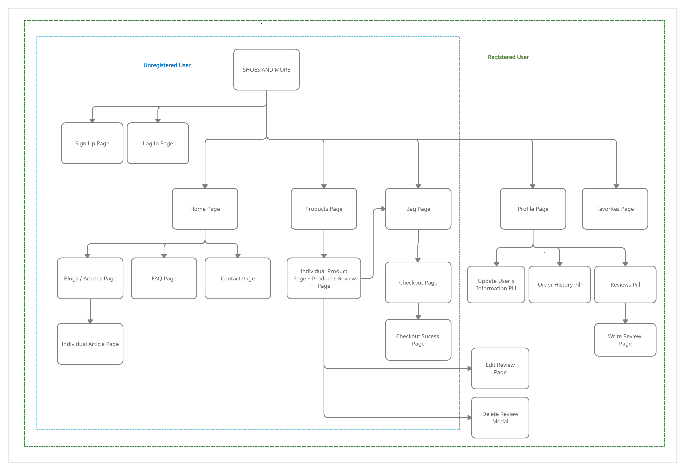
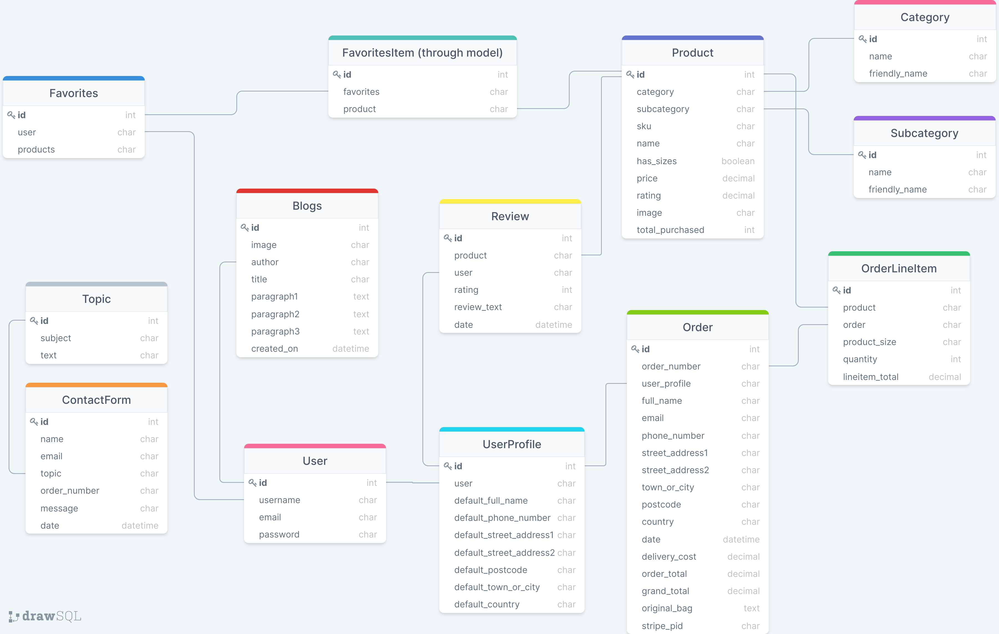

# **Shoes And More**
  

[View live website here]()

   

**Table of Contents**   

------

## **Introduction**   
Welcome to Shoes and More website!
Shoes and More is an e-commerce website that sells shoes and accessories (bags, wallets, etc). It's completed with authentication mechanism and stripe payments to allow users to safely purchased products from the site.  

Please note that this website was created for the Code Institute’s Milestone Project 4 as part of their Diploma in Full Stack Software Development. The requirements are to make a full-stack website, using HTML, CSS, JavaScript, Django+Python, relational database, stripe payments, and other additional libraries as needed.  

   

## **UX Development Plane**   
### **1. Strategy Plane**  
#### **Project Goals**   
The primary goal of this project is to create an e-commerce website that works perfectly, is visually appealing in design, and intuitive for a first time user. It allows user to perform not only the basic functionalities in an e-commerce website (such as sign up/ log in, ability to purchase items and perform payments), but also to ensure that users have a great experience and more interactivity within the site through additional functionalities such as put items into their wishlist, and write reviews, and reading articles.  

#### **User Goals**  
The user is looking for:
- An online store / website that is straightforward and intuitive to use, easy to navigate and to make a purchase on the site. 
- An online store/ website where the user can have other additional activities and engage more store.  

The target user for this site is:
- Young adult, between 18 - 40
- Fun, fashionable people
- People who enjoy the convenience of using technology and social media

#### **Site Owner Goals**  
The site owner is looking to:
- Be able to make money by providing products (and services) to the users. 
- Manage products in the website.

#### **User Stories** 
- As a shopper I want to be able to:
   1. Quickly identify what products/services the site sells.  
   2. Quickly identify deals and special offers.   
   3. Search for a product.   
   4. Identify a glimpse of most populars products.   
   5. View all products, and easily navigate between categories.  
   6. Sort by price, by rating, and by color.   
   7. View individual product's page and read the relevant information.  
   8. Read a product's review.  
   9. Easily select size and quantity of the product, and add it to shopping bag.  
   10. View the shopping bag with products added in it.  
   11. Update the shopping bag by adjusting the quantity of the products, or removing them from the shopping bag.  
   12. Checkout and easily enter my payment information.  
   13. Feel my personal and payment information is safe and secure.  
   14. View an order confirmation after purchasing.  
   15. Receive an email confirmation after purchasing.  
   16. Read relevant articles/ blogs about shoes or accessories.  
   17. Easily navigate within the site, through Navigation Bar and Footer.  
   18. Easily register for an account.  
   19. Find FAQ section for my questions.  
   20. Contact the shop via a contact form.    

- As a registered user/ shopper, I want to be able to:
   1. Access all functionalities that an unregistered shopper can do.  
   2. Easily login or logout.  
   3. Easily recover my password in case I forget it.  
   4. Receive an email confirmation after registering.  
   5. Have a personalized user profile where I can see my order history and change my information.  
   6. Review products that I have purchased before.  
   7. Edit and delete my reviews.  
   8. Add products to the wishlist, so I can quickly find products I'd like to purchase. 
   9. Remove products from the wishlist, so I can remove products I don't wish to purchase.
   9. Easily put the wishlist products into the shopping bag.   

- As an admin and store management, I want to be able to:
   1. Add a product.  
   2. Edit or update a product.  
   3. Delete a product.  

   

### **2. Scope Plane**  
Based on all goals and user stories, a scope was defined for the site with room for future improvements.  

#### **Functional Requirements**  
The unregistered users will be able to:
- Sign up to the site by providing username, email, and password.  
- View all products and sort them by price, rating, and color.
- Search for products
- View product's detail.
- Add products to the shopping bag.
- Update and remove items in the shopping bag.
- Checkout and make a payment.
- Receive email confirmation of the transaction.  

The registered users will be able to:
- Do all things that unregistered users able to do. 
- Log in to the site by providing username and password.
- View profile page.
- Update delivery / contact information on their profile page.
- View order history on their profile page.
- Write reviews for products that they have purchased.
- Edit those reviews.
- Delete those reviews.
- Add products to their wishlist.
- Remove products from wishlist.  

The admin/ site owners will be able to:
- Have all functionalities as a registered user.  
- Add a product to the site.  
- Edit or update a product.  
- Delete a product.  

#### **Non-functional Requirements**  
Users will be able to:
- View articles/ blogs about shoes, accessories, and fashion in general.
- View FAQ page to find answers for their questions.
- Send message to the store via contact form.
- Navigate easily and intuitively throughout the site.  

   

### **3. Structure Plane**  
The website was organized in a Hierarchical Tree Structure that ensures the user can navigate easily and intuitively. Below is the website workflow (was designed using [Creately](https://creately.com/)).  

   
There's a clear page access separation between unregistered users and registered user. While unregistered users can still purchase products and receive the confirmation via email, they are not able to:
- View their order history
- Give reviews (and edit or delete their reviews accordingly)  
- Make a favorite list of products.  

Those features mentioned are available for registered users.

   

### **4. Skeleton Plane**  
Wireframes were created using Figma to design the navigation and interface of the website. The wireframes were created only for desktop, which then will be transformed to high fidelity mock-ups in various device sizes (see Surface Plane). 

- [Wireframe for Home page](readme-testing-files/readme/wireframes/wireframe-home.png) 
- [Wireframe for Products page](readme-testing-files/readme/wireframes/wireframe-products.png)  
- [Wireframe for Individual Product page](readme-testing-files/readme/wireframes/wireframe-individual-product.png)  
- [Wireframe for Favorites page](readme-testing-files/readme/wireframes/wireframe-favorites.png)  
- [Wireframe for Shopping Bag page](readme-testing-files/readme/wireframes/wireframe-shoppingbag.png)  
- [Wireframe for Checkout page](readme-testing-files/readme/wireframes/wireframe-checkout.png)  
- [Wireframe for Profile page (Update user's information)](readme-testing-files/readme/wireframes/wireframe-profile-updateinfo.png)  
- [Wireframe for Profile page (View order history)](readme-testing-files/readme/wireframes/wireframe-profile-orderhistory.png)  
- [Wireframe for Profile page (Reviews)](readme-testing-files/readme/wireframes/wireframe-profile-reviews.png)  
- [Wireframe for Articles page](readme-testing-files/readme/wireframes/wireframe-articles.png)  
- [Wireframe for Individual Article page](readme-testing-files/readme/wireframes/wireframe-individual-article.png)  
- [Wireframe for Contact page](readme-testing-files/readme/wireframes/wireframe-contact.png)  
- [Wireframe for Add / Edit Review page](readme-testing-files/readme/wireframes/wireframe-add-edit-review.png)  
- [Wireframe for Sign Up page](readme-testing-files/readme/wireframes/wireframe-signup.png)  
- [Wireframe for Log In page](readme-testing-files/readme/wireframes/wireframe-login.png)  

   

### **5. Surface Plane**  
High fidelity mock-ups were created using Figma as well for a better and clearer visualization before coding, and also to check if the color scheme and images match and work great together. This has allowed the developer to concentrate solely on the development part (front end and back end), as the design has already made with such details. The high fidelity mock-ups were created in three different device sizes - desktop, tablet, and mobile.  

- [High Fidelity Mock-up for Home page](readme-testing-files/readme/high-fidelity-mockups/mockup-home.png)  
- [High Fidelity Mock-up for Products page](readme-testing-files/readme/high-fidelity-mockups/mockup-products.png)  
- [High Fidelity Mock-up for Individual Product page](readme-testing-files/readme/high-fidelity-mockups/mockup-individual-product.png)  
- [High Fidelity Mock-up for Favorites page](readme-testing-files/readme/high-fidelity-mockups/mockup-favorites.png)  
- [High Fidelity Mock-up for Shopping Bag page](readme-testing-files/readme/high-fidelity-mockups/mockup-shoppingbag.png)  
- [High Fidelity Mock-up for Checkout page](readme-testing-files/readme/high-fidelity-mockups/mockup-checkout.png)  
- [High Fidelity Mock-up for Profile page (Update user's information)](readme-testing-files/readme/high-fidelity-mockups/mockup-profile-updateinfo.png)  
- [High Fidelity Mock-up for Profile page (Order History)](readme-testing-files/readme/high-fidelity-mockups/mockup-profile-orderhistory.png)  
- [High Fidelity Mock-up for Profile page (Reviews)](readme-testing-files/readme/high-fidelity-mockups/mockup-profile-reviews.png)  
- [High Fidelity Mock-up for Articles page](readme-testing-files/readme/high-fidelity-mockups/mockup-articles.png)  
- [High Fidelity Mock-up for Individual Article page](readme-testing-files/readme/high-fidelity-mockups/mockup-individual-article.png)  
- [High Fidelity Mock-up for Contact page](readme-testing-files/readme/high-fidelity-mockups/mockup-contact.png)  
- [High Fidelity Mock-up for Add / Edit Review page](readme-testing-files/readme/high-fidelity-mockups/mockup-add-edit-review.png)  
- [High Fidelity Mock-up for Sign Up page](readme-testing-files/readme/high-fidelity-mockups/mockup-signup.png)  
- [High Fidelity Mock-up for Log In page](readme-testing-files/readme/high-fidelity-mockups/mockup-login.png)  

#### **Color Scheme**  
The overall color-theme of the website was natural earthy colors, which have relaxing and comforting influences, and encourages feelings of warmth and calmness. Using [Coolors](https://coolors.co), I started with beige (#E8DCD5) and brown (#644536), and generated one more color that compliments them both - the result was a salmon color (#B2675E). I also found a hero image that fits the overal theme and colors accordingly.   
  

#### **Typography**  
All of the fonts were sourced from [Google Fonts](https://fonts.google.com).   
- Main font: Noto Sans   
   Noto Sans is a sans-serif font, used as the main font, for all paragraphs and buttons. Open Sans was chosen because it has a modern and clean style. 
- Secondary font: DM Serif Display    
   DM Serif Display is a serif font, used as the headers font on the Home page, in order to contrast them with serif font.  

#### **Design Changes on The Final Product**  
While I relied heavily on these Wireframes in order to maintain the desired design, there are several differences between the Mockups and the final product:
- I changed the logo to a new one that's thicker and easier to spot, as the previous logo in the mockups was too thin and didn't look good on small devices.
- In the wireframes and mockups, there was a subscription to the newsletter box. I decided not to include this subscription to the newsletter functionality on the final product due to time constraint. 
- The color #B2675E was changed to a slightly dark color #A5554C, because it didn't have enough contrast when paired with white text.
- Minor things like buttons colors and image difference were purely design choices that was taken during with the website development. 

   

## **Database Design**    

Database schema was designed using [drawsql](https://drawsql.app/). The database was first managed using SQLite during the development process, then Postgres in production with Heroku. 
  

- **Category model**   
   - Stores category name for a product. The categories in this case are Women, Men, and Kids.
   - Name field: the name used for database purpose.
   - Friendly_name field: the name used for display.

- **Subcategory model**
   - Stores subcategory name for a product. The subcategories in the database are Sandals, Sneakers, Oxfords, Heels, Boots, Mules, Flats, Outdoors, Loafers, Slippers, Sale, Accessories, and New Arrivals.  
   - The Category model and Subcategory model have no relationship. I decided not to define a relationship/ pairing between them to make it more flexible. Both are fully independent of each other.  
   - Name field: the name used for database purpose.
   - Friendly_name field: the name used for display.  
   
- **Product model**  
   - Stores detailed information about a product.
   - Category field: the category of the product, a foreign key from Category model.
   - Subcategory field: the subcategory of the product, a foreign key from Subcategory model. 
   - Sku field: alpha numeric code assigned for a product.
   - Name field: the name of the product, a required field.
   - Has_sizes: has a boolean value - Yes for shoes, No for accessories.
   - Price: the price of the product, a required field.
   - Rating: the rating of the product. Each product has an initial rating value given by retailer based on its quality from manufacturer. The default value is 3. Each time a user gives a rating to the product, it calculates the average and update this field (read more about this on Feature section - Add Review)  
   - Image: the image of the product.
   - Total_purchased: the quantity of purchased for this product. The initial (default) value is 0. Each time a user purchases the product, the value also adds up.  

- **User model**  
   - Stores registration information of a user, the model was created as one of the components of Django's authentication system (more information on this, see [django.contrib.auth](https://docs.djangoproject.com/en/4.0/ref/contrib/auth/)). The fields include (but not limited to) username, email, and password.  

- **Order model**
   - Stores all information related to a successfully placed order.
   - Order_number field: a unique order number generated automatically using UUID.
   - User_profile field: the user that ordered, a foreign key from UserProfile model (if the user is registered).
   - Full_name field: the full name of the buyer.
   - Email field: the email address of the buyer.
   - Phone_number: the phone number of the buyer.
   - Street_address1: the first line of street address of the buyer.
   - Street_address2: the second line of street address of the buyer.
   - Town_or_city: the town or city name of the buyer.
   - Postcode: the postcode of the buyer.
   - Country: the country of the buyer.
   - Date: the date of purchase.
   - Delivery_cost: the delivery cost of the transaction.
   - Order_total: the total price of order (the total of quantity times individual product price).
   - Grand_total: the order_total + delivery_cost.
   - Original_bag: a json object of the products and sizes that were in the bag.
   - Stripe_pid: a payment intent id from stripe for successfull order.

- **OrderLineItem model**
   - Stores order details of a product that have been purchased.
   - Product field: the product ordered, a foreign key from Product model.
   - Order field: the order number for this product ordered, a foreign key from Order model.
   - Product_size field: the size of the product ordered.
   - Quantity field: the quantity of the product ordered.
   - Lineitem_total field: the quantity times the individual product price.  

- **UserProfile model**
   - Stores user's address information for registered user.
   - User field: the user itself, a foreign key from User model.
   - Default_phone_number field: the phone numbe of the user.
   - Default_street_address1 field: the first line of street address of the user.
   - Default_street_address2 field: the second line of street address of the user.
   - Default_town_or_city field: the town or city name of the user.
   - Default_postcode field: the postcode of the user.
   - Default_country field: the country of the user.  

- **Review model**  
   - Stores user's review of products that the user had previously purchased.
   - Product field: the reviewed product, a foreign key from Product model.
   - User field: the user itself, a foreign key from UserProfile.
   - Rating: the rating that the user gave for the product.
   - Review_text: the review that the user gave for the product.
   - Date: the date it was created.

- **Blog model**  
   - Stores articles/ blogs for the website.
   - Image field: the image for the article.  
   - Author field: the author of the article, a foreign key from User model.
   - Title field: the title for the article.
   - Paragraph1: the first paragraph for the article.
   - Paragraph2: the second paragraph for the article.
   - Paragraph3: the third paragraph for the article.
   - Created_on: the data it was created.  

- **Favorites model**  
   - Stores list of favorites products of a registered user.
   - User: the user that created the favorites list, a foreign key from User model.
   - Products field: the list of products.  
   - Because there would be a many to many relationship between favorites and products, i.e. one product can be listed in multiple (users) favorites , and one favorites can have multiple of products, I decided to define a through/ intermediary model between the two models ([source from django documentation](https://docs.djangoproject.com/en/4.0/ref/models/fields/#django.db.models.ManyToManyField.through_fields)). The through model named  **FavoritesItem model**, which stores each product in one table with favorites as a foreign key.  

- **Topic model**
  - Stores the topics of contact form. 
  - Subject field: a one-word name for database purposes.
  - Text field: a longer name for display on the contact form.
  - I decided to make this into separate model instead of a choice field, because I wanted to define a separate naming fields for database and for display, and for future flexibility in adding/ editing/ removing a topic.  

- **ContactForm model**
  - Stores the contact form filled by the user.
  - Name field: the name of the user.
  - Email field: the email of the user.
  - Topic field: the topic of the message, a foreign key from Topic model.
  - Order_number: the order number if the user has it. Filled manually by the user.
  - Message: the message in the form.
  - Date: the date it was sent.  

   

## **Features**  
### **A. General Design Features**  
- **Fully responsive** - Each page of the site is fully responsive on all device sizes (with minimum dimension 320px or an iPhone 4/5) and features intuitive navigational buttons.  

- **Navbar** (on all pages)   
      

   - The Navbar is responsive and turns to a hamburger menu on a smaller device. It is also sticky, thus it follows along when the user scrolls down, so the user can easily navigate the site without scrolling back to the top.
   - The logo is placed at the top center of the Navbar, creating a simmetry between left and right, and links back to Home page.
   - A search box is positioned on the left side of the Navbar, providing the ease of searching a keyword from the beginning. 
   - For unregistered users, the Sign In buttons are visible right away, conventionally placed at the top-right of the page. It's a dropdown link which will give options to Register or to Log In. After the user successfully logged in, the previously Sign In button turns to a My Account dropdown button, which provides the links to My Profile and to Log Out.
   - Favorites and Shopping Bag links are placed on the Navbar to give a quick access from any page the user is currently at.   
   - There are 6 nav-links to navigate between products categories and subcategories - All Products, Women, Men, Kids, Accessories, and Sale.
   - A sales banner about free delivery is placed right below the Navbar, and also displayed on all pages.  

- **Footer** (on all pages)  
    
   The Footer uses the same color as the Navbar and provides all navigation links, the social media links of the store as well (that opens in a new tab), and the logo that leads back to the Home page.  

- **Toast message**   
Toast messages provide the user the necessary feedback of their activities whether it's successfully executed or not. The toast messages are color coded: red for error messages, blue for info/ alert messages, yellow for warning messages, and green for succcess messages. Users will get success toast the most, for example when users add a product to the shopping bag, they will get a success toast message with bag display. While when users for example add a product to their favorites list, they will get a success toast message without bag display. Below are the examples of success toast messages (without bag and with bag display).   

   

### **B. Page Features**  
#### **1. Home Page**  
[See the image of the Homepage here](readme-testing-files/readme/home-page.png)   
- On the Home page, I used multiple images as a marketing strategy to attract users attention to browse more into the website, and hopefully to make a purchase.  
- The hero-image covers 100% of the viewport height and width, with an impactful heading in a jumbotron to give the user a great first impression. It introduces the new arrivals, which are products for spring, with a CTA button to directly browse the new arrivals.  
- The sneakers collection section provides direct navigation to the sneakers.  
- The shoes for the whole family section provides direct navigation to the main categories based on gender/ age: Women, Men, and Kids.  
- The best sellers section gives information to users which products have been purchased the most, which indicates the most popular products. The products are displayed in a multi-items carousel of 8 products.  
- The final sale section provides direct navigation to the sale products.   
- The bags and accesssories section provides direct navigation to the accessories products.  
- The articles and blogs section displays the latest 3 articles written by store admin or other superusers. Users can also navigate to the articles page and view all articles by clicking the See More Articles button.  

#### **2. Products Page**  
[See the image of Products page here](readme-testing-files/readme/products.png)   
- The Products page starts with a breadcrumb navigation that indicates the current page’s location within a navigational hierarchy. For example, if the user chose the Women Sneakers, then the breadcrumb will show: Home > Women > Sneakers.
- Below the breadcrumb there's a 'Final Sale' banner, as normally users are interested in checking out the sale items first. If users click the shop now button, it will filter the products to display only the sale items.  
- Side Navigation feature (only on desktop) helps users to quickly navigate through the categories and subcategories, and will filter the products to display only the categories and subcategories of choice. On smaller devices, users can click the hamburger icon to navigate.
- The result of products displayed can also be sorted by price, rating, and name.
- The products are displayed into 4 columns on large screen, 3 columns on medium screen, and 2 columns on small screen.  
- On the top right of each of the product's image, there's a heart icon that turns red when user hovers over it. By clicking this icon, a registered user can add the product to their favorites list. The heart icon will then turns red to indicate that the product has listed in user's favorites.
- A back to top button is in fixed positioned on the right side of the screen.  

#### **3. Individual Product Page**  
[See the image of Individual Product page here](readme-testing-files/readme/individual-product-page.png)  
- The Individual Product page starts with a breadcrumb navigation that indicates the current page’s location within a navigational hierarchy. 
- The page features the product's image, name, price, rating, category tag, and reviews on the bottom of the page. 
- On the top right of the product's image, there's a heart icon that turns red when user hovers over it. By clicking this icon, a registered user can add the product to their favorites list. The heart icon will then turns red to indicate that the product has listed in user's favorites.
- Users can add the product to their shopping bag by choosing the size, the quantity, and click Add to Bag button.  
- A registered user is able to edit or delete their own review. The buttons to edit and to delete show up below it.  

#### **4. Favorites Page**  
[See the image of Favorites page here](readme-testing-files/readme/favorites-page.png)  
- The Favorites page features all products that the user has been saved as their favorites. The products are displayed in resemblance with products page, using the product's image, name, price, and rating. They are displayed into 4 columns on large screen, 3 columns on medium screen, and 2 columns on small screen. 
- The heart icon on the top right of product's image is replaced by a trash icon, which indicates its function to remove the product from favorites.
- Since favorites are a list of products that the user is interested in and willing to buy, below each product, there are an option to choose the size and an Add to Bag button. This allows users to add the product to their shopping bag directly and easily, without going to the individual product page.  

#### **5. Bag Page**  
[See the image of Bag page here](readme-testing-files/readme/bag-page.png)  
- The Bag page features all products that the user has been added to the shopping bag, and the total price that the user has to pay (if the user decides to continue). On this page, users can adjust the quantity of products, or remove the products from the bag.  
- It displays the products information such as product's image, name, sku, price, size of choice, and the quantity of choice.
- A trash icon is placed on each product's row, which indicates that users can use this button to remove the specified product from their bag.
- The subtotal column informs users the product's price times the quantity. If the user changes the quantity, the subtotal changes accordingly.
- The total price, the delivery price, and the grand total are separated in a box, to gain user's attention on what the next action is. A CTA button to chekout, and a visual information of accepted method of payments are placed in the box as well.
- If the user decides to browse for more products, a Keep Shopping button is positioned below the grand total box as a secondary option.  

#### **6. Checkout Page**  
[See the image of Checkout page here](readme-testing-files/readme/checkout-page.png)  
- The Checkout page features the checkout form to process the transaction and the order information.
- The Chekout form is clearly divided into 3 sections: Details (user's full name and email), Delivery (user's delivery address), and Payment (user's card detail).  
- The order information is filled with summary of all products from the Bag page, along with the grand total. CTA buttons are present inside the box for the user to pay and therefore complete the order, or to go back to Adjust bag as secondary option. 

#### **7. Checkout Success Page**   
[See the image of Checkout Sucess page here](readme-testing-files/readme/checkout-success-page.png)  
- The Checkout Success page features the summary of order transaction that had just successfully processed, right after the user proceed to complete the order on Checkout page.
- Users can see the Order information, items list, delivery address, and billing information.
- Registered users can also find this summary of order on their Profile page.  

#### **8. Profile Page - My Information**  

#### **9. Profile Page - My Purchases**  

#### **10. Profile Page - Ratings/Reviews**  

   
