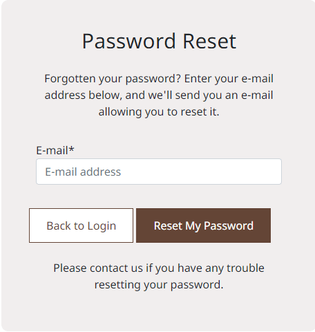
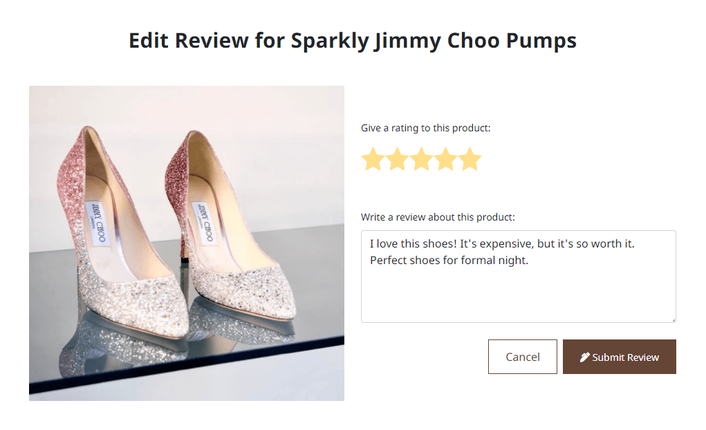
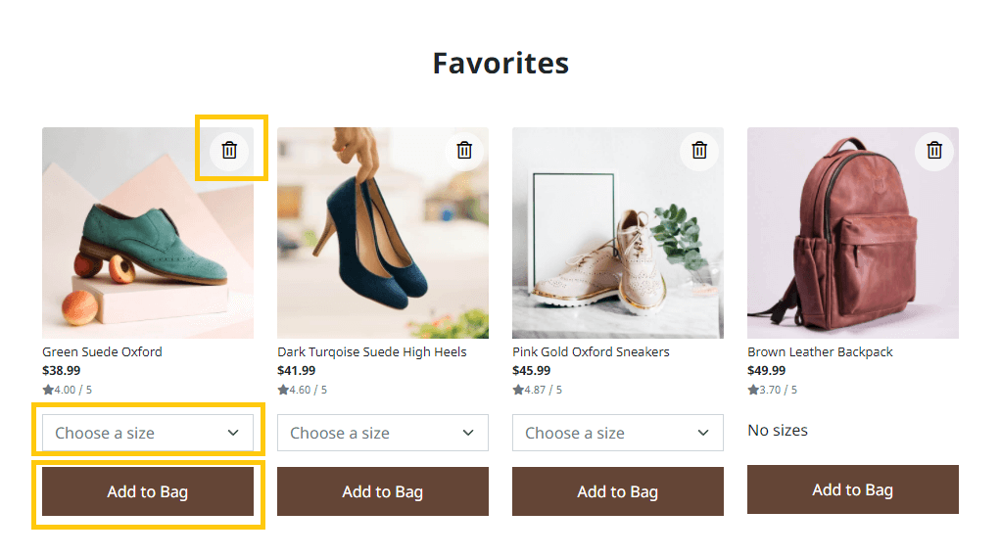
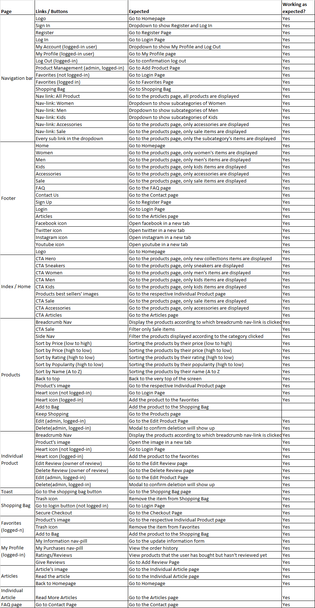
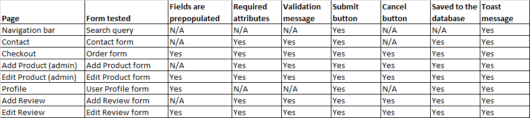
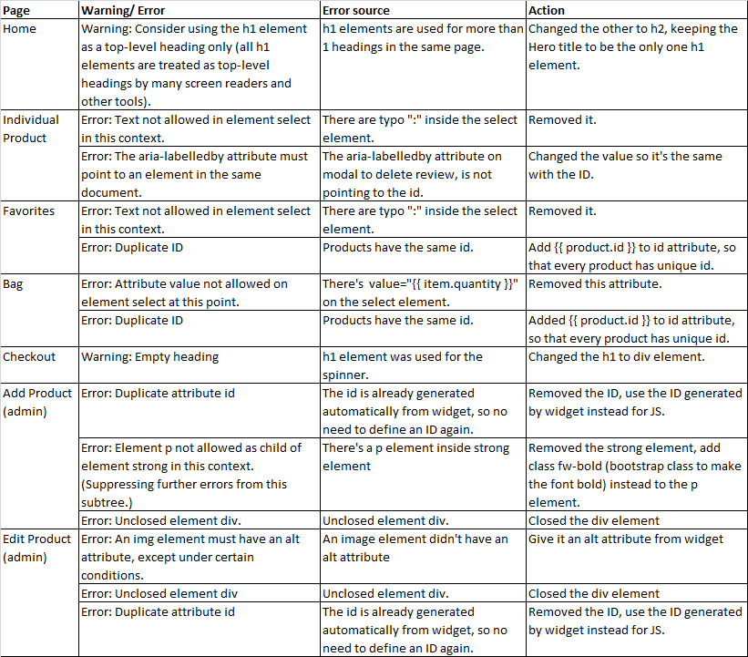

# **Shoes And More - Testing**  

[Back to the main README.md file](https://github.com/dissyulina/shoesandmore#shoes-and-more)  

[Back to the Testing section in main README.md file](https://github.com/dissyulina/shoesandmore#testing)

[View the live website here](https://shoes-and-more.herokuapp.com/)  

## **Table of Contents**  
1. User Stories Testing  
   - Unregistered Users' Goals  
   - Registered Users' Goals  
   - Administrative Account Holder's Goals  
2. Autoprefixer CSS  
3. Manual Testing  
   - Browsers Compatibility  
   - Devices  
   - Responsiveness  
   - Links  
   - Forms  
   - Defensive Testing  
4. W3C Validator Testing  
   - HTML  
   - CSS  
5. JSHint Testing  
6. Pep8 Online Testing  
7. Lighthouse Testing  

<br/>

The website was extensively tested during the development and after development by using:
- ```console.log()``` and developer tools for front-end  
- Printing variables to the terminal for back-end  
- Manual testing and developing based on the user stories  
- Automated testing on Django at the end of development phase. 
- Few other testing using programs 

The testings are documented below.


## **1. User Stories Testing**  
As a shopper I want to be able to:

1. *Quickly identify what products/services the site sells.*   
   Company logo is visible right at the top-center of the homepage. The company name is straightforward describing what products we sell. On top of that, the hero image is clearly picturing shoes as the main product. As users scrolls down the home page, they will find various navigation using large images of the products.     
     

2. *Quickly identify deals and special offers.*  
   As users scrolls down the homepage, they will find the Final Sale section. When the 'Shop Now' button is clicked, they will be directed to the products page with all the sale items already filtered.   
      

3. *Search for a product.*  
   Users can search for a product right away when they open the website. The search functionality is located at the top-left of screen on desktop, and on right side on mobile. 
     

4. *Identify a glimpse of most populars products.*  
   Still on the homepage, users will also find 8 most popular (best-sellers) products on the website. They are displayed as a multi-items carousel, and users can navigate to the left and right by clicking the arrows.  
     

5. *View all products, and easily navigate between categories.*  
   There are 3 main categories in this website - Women, Men, and Kids. When users click on a category, it will display all subcategories within it - Boots, Sneakers, Flats, etc. For desktop, there's a side navigation which will make a great user experience to navigate between the categories and subcategories. On mobile, the side nav is replaced by a dropdown option. Breadcrumb Navigation is available as well to allow users to navigate back to the more general category.  
      
     

6. *Sort by price, by rating, and by popularity.*    
   The sort functionality is positioned on the top-left on the products page.  
      

7. *View individual product's page and read the relevant information.*  
   Users can click on the product's image and it will direct them to the Individual Product page where they can find all the relevant information.  
      

8. *Read a product's review.*   
   On the Individual Product page, users can scroll down and find the review below the product's information.  
      

9. *Easily select size and quantity of the product, and add it to shopping bag.*   
   Users can easily select the size and quantity, and then click on Add To Bag button to buy it.   
     

10. *View the shopping bag with products added in it.*   
   If users add a product to the shopping bag, a toast will show up at the top-right corner to inform the user about the shopping bag.  
     
   Users can also view the Shopping Bag page by clicking the navigation in the Navigation Bar, or by clicking the 'Go To The Shopping Bag' button inside the toast.  
     

11. *Update the shopping bag by adjusting the quantity of the products, or removing them from the shopping bag.*   
   Users can easily update or adjust the quantity of the product by selecting the quantity, and the Subtotal will be updated accordingly. If users want to remove the product from the shopping bag, they can click on the Trash icon.  
     

12. *Checkout and easily enter my payment information.*  
13. *Feel my personal and payment information is safe and secure.*  
   By clicking the 'Secure Checkout' button on the Shopping Bag page, users will be directed to the Checkout page. In the payment section, the card payment input is divided into the number, expired date, cvc, and zip code.   
     

14. *View an order confirmation after purchasing.*  
   After users fill out the checkout form and click on the 'Complete Order' button, they will be directed to a success page where users can see their order information. At the same time they will also get an email order confirmation on their inbox.  
     

15. *Receive an email confirmation after purchasing.*  
   As mentioned above, users will also get an email confirmation to their inbox everytime they complete an order.   
     

16. *Read relevant articles/ blogs about shoes or accessories.*   
   Users can find the Articles page by clicking the link to the articles on footer, or on the homepage. Users can choose to view an article by clicking one of them.  
     
     

17. *Easily navigate within the site, through Navigation Bar and Footer.*
   Navigation Bar and Footer are available on all pages. Navigation bar is fixed on the top of screen, so it will stays on the screen as the users scroll down to provide easy access to navigate throughout the site.   
   Navbar and Footer on desktop:   
      
      
   Navbar and Footer on mobile:   
     
        

18. *Easily register for an account.*   
   By clicking the 'Sign In' link on the left side of the Navbar on desktop, or clicking the user icon on mobile, users can either register or login to the website. Users then will be directed to the Register / Sign Up page or Log In page.  
       

19. *Find FAQ section for my questions.*   
   Users can find the link to go to the FAQ page in the footer.  
      

20. *Contact the shop via a contact form.*   
   Users can also find the link to go to contact page in the footer.   
      

<br/>

As a registered user/ shopper, I want to be able to:
1. *Access all functionalities that an unregistered shopper can do.*   
   All of the features and functionality above are certainly also available and accessible for registered / logged-in users.   

2. *Easily login or logout.*  
   Logged-in users can log out by clicking the user icon on the left side of the Navbar.  
         

3. *Easily recover my password in case I forget it.*   
   On the Log In page, there's an option to change your password below the buttons. When clicked, it will lead the users to the password reset page.   
         

4. *Receive an email confirmation after registering.*  
   After successfully register to the website, users then will be informed to check on their inbox.  
         
   In the user's inbox, an email from Shoes And More is found. Users then will be asked to verify their email by clicking the link provided.  
         
   After the link is clicked, users then will be directed back to the website, and to confirm the email address.   
         

5. *Have a personalized user profile where I can see my order history and change my information.*   
   By navigating to the My Account in the Navbar (or user icon on mobile), and click on My Profile, users can see their profile page. This page is divided into 3 pills/tabs - My Information, My Purchases, and Ratings/Reviews. User can see/update their delivery information and see their order history by clicking My Information pill and My Purchases pill respectively.  
     
      

6. *Review products that I have purchased before.*  
   User can review the products that they have already purchased before by navigating to the Ratings/Reviews pill on the My Profile page. 
      
   By clicking the Give Review button, users will be directed to the Add Review page.  
     

7. *Edit and delete my reviews.*  
   Once users submit a review, they can view the review by navigating to the Individual Product page in the Reviews section. If the user owns the review, there will be two buttons available under the review - Edit button and Delete button.  
     

   When the Edit button is clicked, the user will be directed to the Edit Review page, which has a similar layout with the Add Review page. The only difference is, on Edit Review, the input rating and review are already pre-populated with the existing review. User can submit the updated review by clicking the 'Submit Review' button.   
      

   When the Delete button is clicked, a modal will show up to confirm users if they really want to delete their review. To confirm, click the 'Yes, Delete' button.  
     

8. *Add products to the wishlist, so I can quickly find products I'd like to purchase.*  
   Users can add products to their favorites by clicking the heart icon on the top-right of each product. This heart icon then turned red if the product is in the user's favorites.  
       

9. *Remove products from the wishlist, so I can remove products I don't wish to purchase.*  
10. *Easily put the wishlist products into the shopping bag.*   
   By clicking the Favorites link on the Navbar (heart icon on mobile's Navbar), user can navigate to the Favorites page to view all products the user has added to favorites. Users can remove products from the Favorites by clicking the Trash-can icon on the top-right of each product. Users can also directly add the product to the shopping bag by choosing a size and then click on 'Add to Bag' button.  
       


As an admin and store management, I want to be able to:
1. *Add a product.*   
   Admin can add a product to the website by logging in as admin, navigate to My Account and choose Product Management. Admin then will be directed to the Add Products page. After filling out the form, they can click 'Add Product' button.   
      

2. *Edit or update a product.*   
   Admin can edit a product by logging in as admin, navigate to the Products page or the Individual Product page and click on Edit link.  
      

   Admin then will be directed to the Edit Products page. After filling out the form, they can click 'Edit Product' button.  
      

3. *Delete a product.*   
   Admin can delete a product by logging in as admin, navigate to the Products page or the Individual Product page and click on Delete link. A modal will then show up to confirm the deletion. Admin can confirm it by clicking on the 'Yes, Delete' button.  
      

<br/>  

## **2. Auto Prefixer CSS**   
[Autoprefixer CSS](https://autoprefixer.github.io/) was used to add CSS vendor prefixes to the CSS rules after the developing process was done, to ensure that the they work across all browsers.  

<br/>  

## **3. Manual Testing by The Developer**  
### **Browsers Compatibility**   
The website was tested through the following browsers: Google Chrome, Microsoft Edge, Opera, Mozilla Firefox, and Safari (iOS) browsers.  

### **Devices**  
The website was also viewed on the following devices:  
- Windows Desktop  
- Windows Laptop  
- Tablets: iPad Mini 2 and iPad 2018  
- Mobile: iPhone7, iPhone 8, iPhone 12 Mini, Asus Zenfone Max Pro M2, and LG G5
- Friends and family members were asked to review the site on their devices and to point out any bugs and/or user experience issues.  

### **Responsiveness**   
To check the responsiveness of the website across all devices, the developer tools are used regularly during the developing process. Based on the  
**Result**: 

### **Links**   
All links and buttons were tested to ensure that:  
- All navigation links are linking correctly and working as expected.    
- The social media buttons are working and opening in a new tab.  

**Result**: All of the links and buttons are working properly.  
   


### **Forms**  
The form was also tested to ensure that:  
- For a few forms such as Edit Review, Edit Product, Checkout, and User Profile Information form, the fields are automatically filled out/prepopulated with the existing data (if the data is available). 
- The required attributes are working.  
- There's a validation message that explains the correct format if the user filled in the wrong format (for username and password).  
- Submit and Cancel/ Back button work as expected.  
- Data get saved into the database.  
- Toast message informs feedback after submitting the form.  

**Result**: All of the links and buttons are working properly.   

  


### **Defensive Testing**  
The defensive testing was done to make sure certain actions can only be performed by authorized users/admin. The test was done as below:


## **HTML & CSS Validator Testing**  
I planned to do the HTML & CSS testing useing W3C Validator, but unfortunately on the day that I did this testing (Feb 27th 2022), the W3C was offline the whole day. Due to time constraint (the deadline for this project was Feb 28th 2022), I decided to use another HTML & CSS Validator.  

### HTML   
[Validator.nu (X)HTML5 Validator](https://html5.validator.nu/) was used to validate the website on the HTML part. These are the errors and warnings I got:   
  
After fixing all the warnings and errors, all pages passed the Validator. Below are the screen capture of the result for every pages.  
- [Homepage (index.html)](readme-testing-files/testing/html-validator/home.png)   
- [Products Page (products.html)](readme-testing-files/testing/html-validator/products.png)   
- [Individual Product Page (product_detail.html)](readme-testing-files/testing/html-validator/individual-product.png)      
- [Add Product Page (add_product.html)](readme-testing-files/testing/html-validator/add-product.png)   
- [Edit Product Page (edit_product.html)](readme-testing-files/testing/html-validator/edit-product.png)   
- [Shopping Bag Page (bag.html)](readme-testing-files/testing/html-validator/shopping-bag.png)   
- [Checkout Page (checkout.html)](readme-testing-files/testing/html-validator/checkout.png)   
- [Checkout Success Page (checkout_success.html)](readme-testing-files/testing/html-validator/checkout-success.png)   
- [Favorites Page (favorites.html)](readme-testing-files/testing/html-validator/favorites.png)   
- [Profile Page (profile.html)](readme-testing-files/testing/html-validator/profile.png)   
- [Add Review Page (add_review.html)](readme-testing-files/testing/html-validator/add-review.png)   
- [Edit Review Page (edit_review.html)](readme-testing-files/testing/html-validator/edit-review.png)   
- [Articles Page (articles.html)](readme-testing-files/testing/html-validator/articles.png)   
- [Individual Article Page (article.html)](readme-testing-files/testing/html-validator/individual-article.png)   
- [Contact Page (contact.html)](readme-testing-files/testing/html-validator/contact.png)   
- [FAQ Page (faq.html)](readme-testing-files/testing/html-validator/faq.png)   

### CSS   


## JavaScript Testing   
I ran the javascript code through [JSHint](https://jshint.com/), and there were some warnings about missing semicolons - which now have been fixed, and one undefined variable: ```Stripe```. We know that ```Stripe``` is an external variable from the Stripe Payment that we use in the website, so it's not defined inside the JS file.  
See below the screencapture of the testing result.  
- [stripe_elements.js](readme-testing-files/testing/js-hint/stripe-elements-js.png)    
- [products.js](readme-testing-files/testing/js-hint/products-js.png)    
- [reviews.js](readme-testing-files/testing/js-hint/review-js.png)    
- [profiles.js](readme-testing-files/testing/js-hint/profiles-js.png)    

<br/>  

## Flake8 and Pep8 Online Testing  
Using Flake8 python linting on Gitpod, I have fixed almost all problems.  

Still existing problems:
- On apps.py in checkout app : 
   Problem: ```'checkout.signals' imported but unused```  
   Explanation: It is to be imported, but the linting doesn't know that yet and so throws an error, so I decided to ignore this error.  
- On webhooks.py in checkout app:
   Problem: ```local variable 'e' is assigned to but never userd```   
   Explanation: The lint was catching too general exception Exception (broad-except). I decided to ignore this error.
- On settings.py in project's folder:
   Problem: ```line too long (91 > 79 characters)```
   ```
   AUTH_PASSWORD_VALIDATORS = [
      {
         'NAME': 'django.contrib.auth.password_validation.UserAttributeSimilarityValidator',
      },
      {
         'NAME': 'django.contrib.auth.password_validation.MinimumLengthValidator',
      },
      {
         'NAME': 'django.contrib.auth.password_validation.CommonPasswordValidator',
      },
      {
         'NAME': 'django.contrib.auth.password_validation.NumericPasswordValidator',
      },
   ] 
   ```   
   Explanation: I decided to ignore this problem as the lines couldn't be broken down without breaking the password validation functionality.   
   
All other warnings, errors, and problems on Gitpod's flake 8 are resolved.   

To add more validation to the code, I also used [Pep8 Online](http://pep8online.com/checkresult), and all codes passed the PEP8 requirements.  