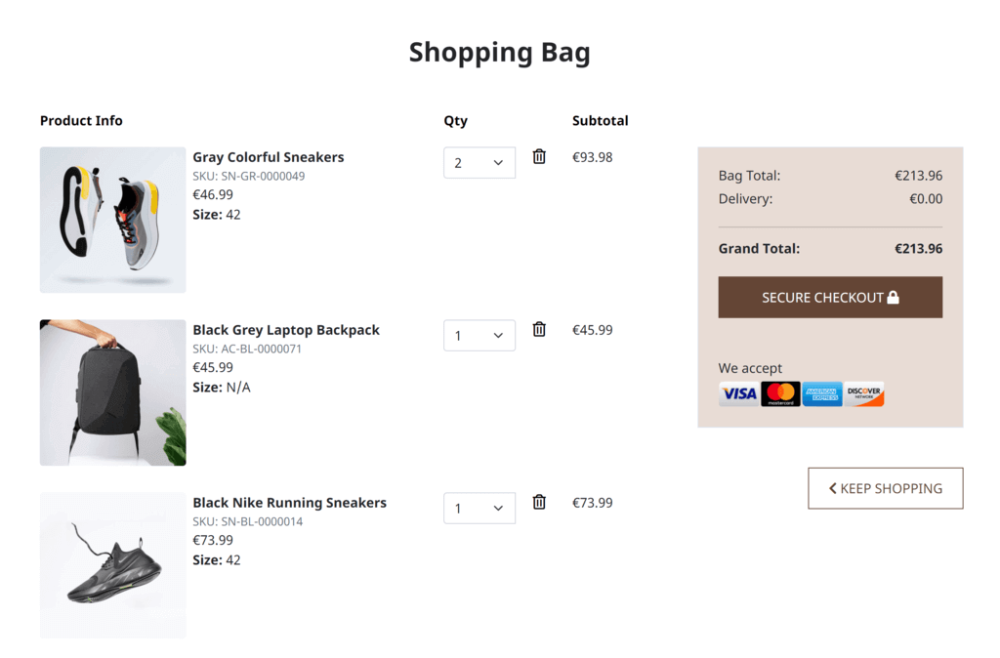
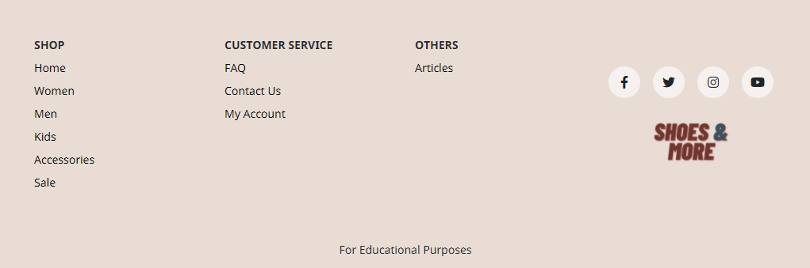

# **Shoes And More - Testing**  

[Back to the main README.md file](https://github.com/dissyulina/shoesandmore#shoes-and-more)  

[Back to the Testing section in main README.md file](https://github.com/dissyulina/shoesandmore#testing)

[View the live website here](https://shoes-and-more.herokuapp.com/)  

## **Table of Contents**  
1. User Stories Testing  
   - Unregistered Users' Goals  
   - Registered Users' Goals  
   - Administrative Account Holder's Goals  
2. Autoprefixer CSS  
3. Manual Testing  
   - Browsers Compatibility  
   - Devices  
   - Responsiveness  
   - Links  
   - Forms  
   - Defensive Testing  
4. W3C Validator Testing  
   - HTML  
   - CSS  
5. JSHint Testing  
6. Pep8 Online Testing  
7. Lighthouse Testing  

The website was extensively tested during the development by using:
- console.log() and developer tools for front-end  
- printing variables to the terminal for back-end  
- manual testing and developing based on the user stories  

### **1. User Stories Testing**  
As a shopper I want to be able to:

1. *Quickly identify what products/services the site sells.*   
   Company logo is visible right at the top-center of the homepage. The company name is straightforward describing what products we sell. On top of that, the hero image is clearly picturing shoes as the main product. As users scrolls down the home page, they will find various navigation using large images of the products.     
     

2. *Quickly identify deals and special offers.*  
   As users scrolls down the homepage, they will find the Final Sale section. When the 'Shop Now' button is clicked, they will be directed to the products page with all the sale items already filtered.   
      

3. *Search for a product.*  
   Users can search for a product right away when they open the website. The search functionality is located at the top-left of screen on desktop, and on right side on mobile. 
     

4. *Identify a glimpse of most populars products.*  
   Still on the homepage, users will also find 8 most popular (best-sellers) products on the website. They are displayed as a multi-items carousel, and users can navigate to the left and right by clicking the arrows.  
     

5. *View all products, and easily navigate between categories.*  
   There are 3 main categories in this website - Women, Men, and Kids. When users click on a category, it will display all subcategories within it - Boots, Sneakers, Flats, etc. For desktop, there's a side navigation which will make a great user experience to navigate between the categories and subcategories. On mobile, the side nav is replaced by a dropdown option. Breadcrumb Navigation is available as well to allow users to navigate back to the more general category.  
      
     

6. *Sort by price, by rating, and by popularity.*    
   The sort functionality is positioned on the top-left on the products page.  
      

7. *View individual product's page and read the relevant information.*  
   Users can click on the product's image and it will direct them to the Individual Product page where they can find all the relevant information.  
      

8. *Read a product's review.*   
   On the Individual Product page, users can scroll down and find the review below the product's information.  
      

9. *Easily select size and quantity of the product, and add it to shopping bag.*   
   Users can easily select the size and quantity, and then click on Add To Bag button to buy it.   
     

10. *View the shopping bag with products added in it.*   
   If users add a product to the shopping bag, a toast will show up at the top-right corner to inform the user about the shopping bag.  
     
   Users can also view the Shopping Bag page by clicking the navigation in the Navigation Bar, or by clicking the 'Go To The Shopping Bag' button inside the toast.  
     

11. *Update the shopping bag by adjusting the quantity of the products, or removing them from the shopping bag.*   
   Users can easily update or adjust the quantity of the product by selecting the quantity, and the Subtotal will be updated accordingly. If users want to remove the product from the shopping bag, they can click on the Trash icon.  
     

12. *Checkout and easily enter my payment information.*  
13. *Feel my personal and payment information is safe and secure.*  
   By clicking the 'Secure Checkout' button on the Shopping Bag page, users will be directed to the Checkout page. In the payment section, the card payment input is divided into the number, expired date, cvc, and zip code.   
     

14. *View an order confirmation after purchasing.*  
   After users fill out the checkout form and click on the 'Complete Order' button, they will be directed to a success page where users can see their order information. At the same time they will also get an email order confirmation on their inbox.  
     

15. *Receive an email confirmation after purchasing.*  
   As mentioned above, users will also get an email confirmation to their inbox everytime they complete an order.   
     

16. *Read relevant articles/ blogs about shoes or accessories.*   
   Users can find the Articles page by clicking the link to the articles on footer, or on the homepage. Users can choose to view an article by clicking one of them.  
     
     

17. *Easily navigate within the site, through Navigation Bar and Footer.*
   Navigation Bar and Footer are available on all pages. Navigation bar is fixed on the top of screen, so it will stays on the screen as the users scroll down to provide easy access to navigate throughout the site.   
   Navbar and Footer on desktop:   
      
      
   Navbar and Footer on mobile:   
    
        

18. *Easily register for an account.*   
   By clicking the 'Sign In' link on the left side of the Navbar on desktop, or clicking the user icon on mobile, users can either register or login to the website. Users then will be directed to the Register / Sign Up page or Log In page.  
       

19. *Find FAQ section for my questions.*   
   Users can find the link to go to the FAQ page in the footer.  
      

20. *Contact the shop via a contact form.*   
   Users can also find the link to go to contact page in the footer.   
      

 
